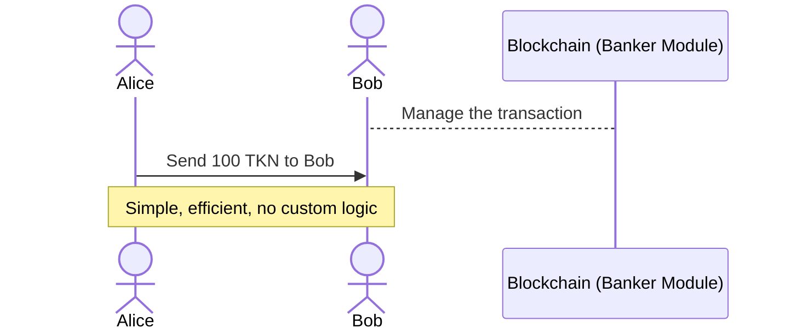
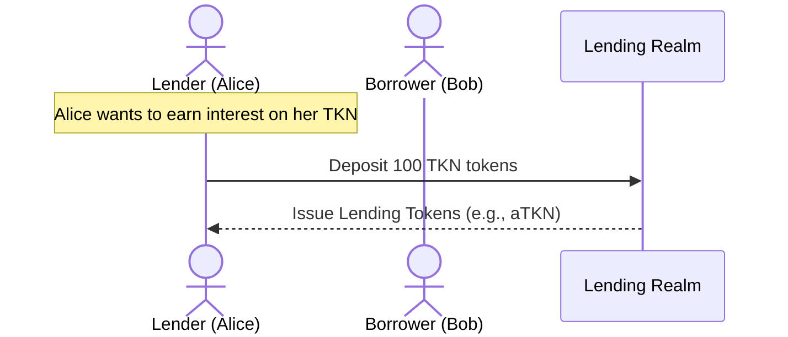
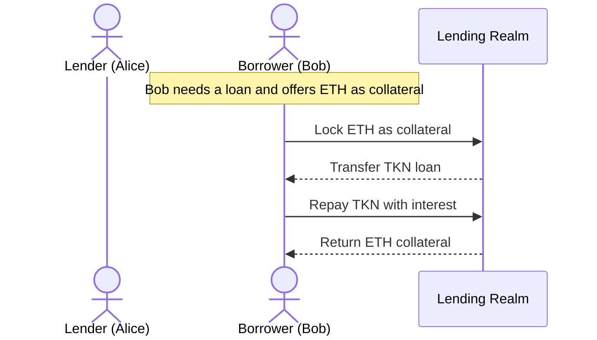
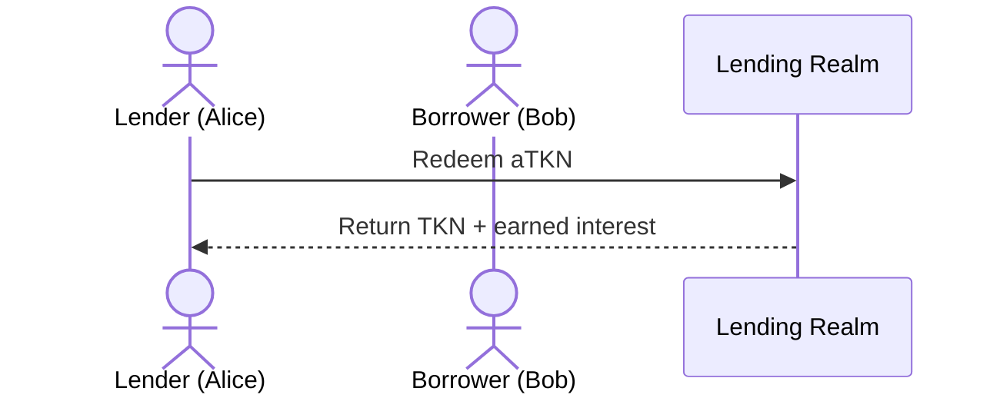

# 🪙 GRC20 and Coins  
## Token Standards in the Gno Ecosystem

How native coins and tokens differs

How to implement tokens and their use cases

<!--
There is different tokens type
; lending token, stable coins, ...
powering a new generation of decentralized finance, governance, and access control mechanisms.

How they are implemented ?
How is it link to currency ?

Problematic :
We will get on the meanings of native coins and grc20, their implementation and use case
-->


---


# ⚙️ <span class="text-blue-500">Coins</span>  


<div class="grid gap-6 mt-2">

Managed by the `banker` module, separate from GnoVM, 

<div class="bg-green-50 p-6 rounded-xl border-l-4 border-green-400 shadow-sm">
✅ <strong>Native type</strong><br>
✅ Efficient gas use -- Lightweight<br>
✅ Used for staking, fees  
</div>

<div class="bg-red-50 p-6 rounded-xl border-l-4 border-red-400 shadow-sm">
❌ <strong>No custom logic</strong><br>
❌ Limited dApp usage  
</div>

</div>


<div class="op75 text-blue-400">

🔗 Read the [Coin](https://docs.gno.land/resources/gno-stdlibs/#coin) and [Bankers](https://docs.gno.land/resources/gno-stdlibs/#banker) Docs
</div>

<!--
To start : 
Simple and secure way to have your own currencies
They’re native to the chain and very efficient.

So it's working like Gnot, the official currency of gno

Their drawback


At the opposite of GRC20

Coins are managed by the banker module, separate from GnoVM. 

You can interact with an RPC call.

For example, if you're creating a coin for cross-chain transfers, Coins are your best bet. They're IBC-ready and their strict rules offer top-notch security.

Read about how to use the Banker module here.
-->

---
layout: default
---


# ⚙️ <span class="text-blue-500">Coins</span>  

A Coin is a Gno type made of a denomination and an amount.


```go {all|3|4|all}
// Defines a basic Coin with a denomination and amount
type Coin struct {
	Denom  string `json:"denom"`  // e.g., "GNOT"
	Amount int64  `json:"amount"` // e.g., 1000
}
```

```go {0|1|1-2|1-3|1-4}
banker.SendCoins(from, to, coins)
banker.IssueCoin(addr, denom, amount)
banker.RemoveCoin(addr, denom, amount)
coins := banker.GetCoins(addr)
```

<!--

    🔄 Payments
    💸 Fees
    🔐 Staking
    🔁 Cross-chain transfers (IBC)
-->

---
layout: top-title
color: sky-light
---

:: title ::
# ⚙️ Coins
:: content ::




---
layout: default
---

# 🧬 <span class="text-purple-400">GRC20 Tokens</span>  
## ERC20-style Smart Contracts

- 🔁 **Fungible**, programmable token standard
- ⚙️ Stored and executed in **Gno realm**

<div class="mt-4 p-4 bg-purple-50 border-l-4 border-purple-400 rounded shadow">
💡 <strong>GRC20 = Gno's version of ERC20/CW20</strong>
</div>

<br/>

> 🛠 Fully programmable logic on-chain

<!--
At the opposite, lets welcome GRC 20

Reference for custom logic in your currencies

A common example is a borrow lender platform


They are perfect for on demand use case
It can be seen as a realm managing currencies

-->

---
layout: top-title
color: purple
---
:: title ::
# 🧬 GRC20 Tokens
:: content ::




---
layout: top-title
color: purple
---

:: title ::
# 🧬 GRC20 Tokens
:: content ::



---
layout: top-title
color: purple
---

:: title ::
# 🧬 GRC20 Tokens
:: content ::



<!--
Very common use case ; essential in DeFi
Would have been impossible with Coins
-->

---
layout: center
color: purple
---

# 🧬 Why use GRC20 ?


<!--
Let's go on some example 
-->
---
layout: center
---

# 🎟 Use Case 1: <span class="text-pink-400">Token Gating</span>

---

## 🎟 Token Gating

Use GRC20 tokens to:

- 🔐 Unlock gated content  
- 🗳 Access private organizations  
- 🎫 Control premium event access

```go 
if (!hasGRC20(user)) {
  return "Access Denied"
}
```
<br/>

<!--
Like it was done with NFT -- Really close in its working
-->
---
layout: center
---

# 💰 Use Case 2: <span class="text-emerald-400">Vaults</span>

---

## 💰 Vaults: Passive Income

- Deposit GRC20 → Get yield-bearing shares
- 📈 Earn interest as the vault grows
- 🔁 Withdraw anytime with rewards

```go
vault.deposit(user, GRC20.amount)
shares = calculateShares(user)
```
<!-- 

## Use Cases:
- 🪙 Savings contracts  
- 🌾 Yield farming strategies  
- 🔐 Staked lockups 

-->
---
layout: center
---

# ♻️ Use Case 3: <span class="text-cyan-400">Wrapping Coins</span>

<!-- Best of both world
you can wrap a Coins into a GRC20 compatible token.
 -->
---

## ♻️ Wrapping Native Coins

- 🧃 Works in DeFi (Decentralized Finance)  
- 🔁 Composable -- Connects to other apps

## ✅ Enables:

- Liquidity pools  
- Lending protocols  
- Cross-chain assets

<!--

AMM auto market maker

-->

---
layout: top-title
color: amber
align : c
---

:: title ::
# ⚔️ Comparison Table

:: content ::

| Feature             | 🪙 Coins (Banker) | 🧬 GRC20 Token       |
|---------------------|------------------|----------------------|
| Native to chain     | ✅               | ❌                   |
| Composable in dApps | ❌               | ✅                   |
| Custom Logic        | ❌               | ✅                   |
| Governance Control  | Centralized      | Decentralized        |
| Efficiency          | ✅               | ⚠️ Slight overhead   |


[Coins vs Grc20](https://docs.gno.land/resources/effective-gno/#choosing-between-coins-and-grc20-tokens)

<!--
Why use grc20
Live inside realms

- Custom minting & burning logic  
- Embed your own rules directly on‑chain 

> Use GRC20 when you need flexibility and control in how tokens behave. 
> Use Coins when you want simplicity and speed.

- Transfer fees, time‑locks, access control  
- Standardized: works with any GRC20‑compatible tool  

In the end, your choice depends on your needs: simplicity and security with Coins, or flexibility and control with GRC20 tokens. 
-->

---
layout: top-title
color: emerald
---

:: title ::

# 🔧 Let's build our own GRC20

:: content ::
Let's fill our functions !
```go {all}
func init() {}

// Informations
func TotalSupply() uint64 {}
func BalanceOf(owner std.Address) uint64 {}

// Create / Delete
func Mint(to std.Address, amount uint64) {}
func Burn(from std.Address, amount uint64) {}

// Send
func Transfer(to std.Address, amount uint64) {}

// Send from another address
func Allowance(owner, spender std.Address) uint64 {}
func Approve(spender std.Address, amount uint64) {}
func TransferFrom(from, to std.Address, amount uint64) {}
```

<!--
type Teller interface {
-->


---
layout: top-title
color: grey
---
:: title ::
# 🔗 Sources

:: content ::
- [🌐 gno.land](https://gno.land)  

- [foo20](https://gno.land/r/demo/foo20)  
- [bar20](https://gno.land/r/demo/bar20)
> 💻 Fully on-chain Gno smart contracts

Read the [Coin](https://docs.gno.land/resources/gno-stdlibs/#coin) and [Bankers](https://docs.gno.land/resources/gno-stdlibs/#banker) Docs
