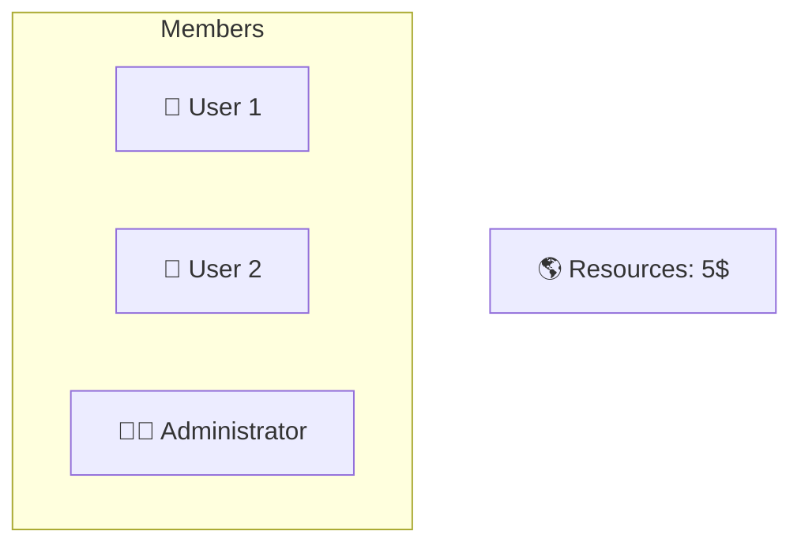
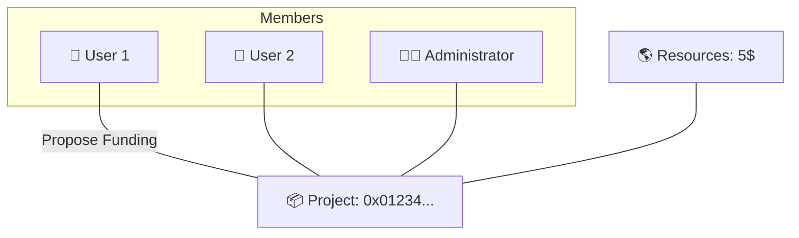
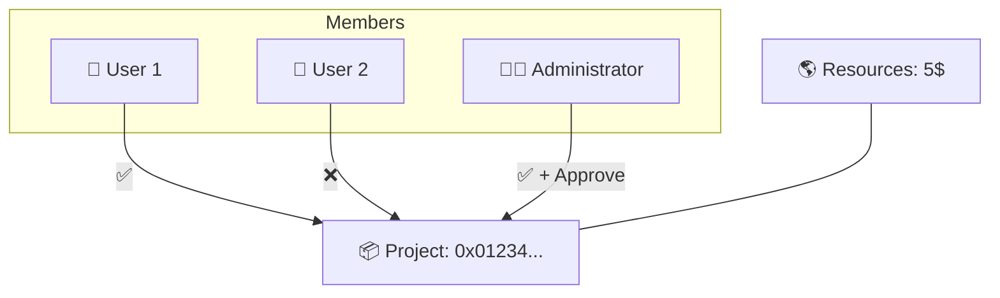
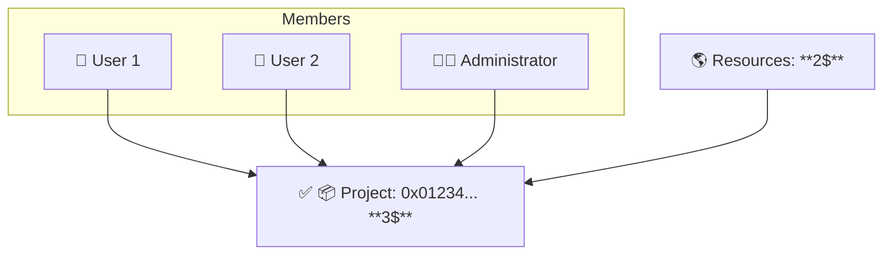
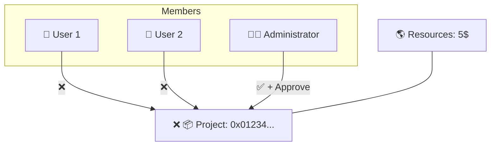

# 🧠 DAOkit on Gno.land

---
layout: top-title
color: sky
---

:: title ::
# 🧠 Use Case: Funding a Project
:: content :: 


<v-switch>


<template #0>

* **Proposal**: "I want to finance Project with \$3"

* **Requirements**:

  * ✅ 50% of Members must vote YES
  * ✅ Administrator Approval


</template>


<template #1>


</template>


<template #2>


</template>


<template #3>



</template>

<template #4>



</template>

<template #5>



</template>

<template #6>

### **Outcome**:

  * 📅 If approved before the deadline: Project is funded
  * ❌ Otherwise: Proposal is rejected

</template>
</v-switch>

---
layout: top-title
color: green
---

:: title ::

# 🧩 DAOkit Components
:: content ::

## 📦 DAOkit

* Core package: Proposals, Resources

## 🧱 basedao

* Manages Members and Roles

## ⚙️ daocond

* Handles Conditions for proposal execution

---
layout: center
---

# 🛠️ Implementing DAOkit

---

#### 🧍 Adding Roles and Members

```go
initialRoles := []basedao.RoleInfo{
    {Name: "admin", Description: "Admin is the superuser"},
    {Name: "public-relationships", Description: "Handles public communication"},
    {Name: "finance-officer", Description: "Manages funds"},
}

initialMembers := []basedao.Member{
    {Address: "g126...zlg", Roles: []string{"admin", "public-relationships"}},
    {Address: "g1ld6...3jv", Roles: []string{"public-relationships"}},
    {Address: "g1r69...0tth", Roles: []string{"finance-officer"}},
    {Address: "g16jv...6e0r", Roles: []string{}},
}
```


---

#### Basic DAO Initialization

```go
var (
    DAO        daokit.DAO
    daoPrivate *basedao.DAOPrivate
)

func init() {
    memberStore := basedao.NewMembersStore(initialRoles, initialMembers)

    condition := daocond.And(
        daocond.MembersThreshold(0.6, memberStore.IsMember, memberStore.MembersCount),
        daocond.RoleCount(1, "finance-officer", memberStore.HasRole),
    )

    DAO, daoPrivate = basedao.New(&basedao.Config{
        Name:             "Demo DAO",
        Description:      "A demo DAO built with DAOkit",
        Members:          memberStore,
        InitialCondition: condition,
    })
}
```


---

#### Voting and Execution Functions

```go
func Vote(proposalID uint64, vote daocond.Vote) {
    DAO.Vote(proposalID, vote)
}

func Execute(proposalID uint64) {
    DAO.Execute(proposalID)
}

func Render(path string) string {
    return daoPrivate.Render(path)
}
```
