```mermaid
graph TD

subgraph Members 
    U1[🧍 User 1]
    U2[🧍 User 2]
    A[👨‍💼 Administrator]
end

    PR[📄 Proposal]
    R[📦 Resource]
    D[🌎 Vault: 5$]

    U1 ---|Propose Funding| PR
    U2 --- PR
    A --- PR
    PR --> R
    D ~~~ PR
```

```mermaid
graph TD

subgraph Members 
    U1[🧍 User 1]
    U2[🧍 User 2]
    A[👨‍💼 Administrator]
end

    PR[📄 Proposal]
    R[📦 Resource]
    D[🌎 Vault: 5$]

    U1 -->|✅| PR
    U2 -->|❌| PR
    A -->|✅ + Approve| PR
    PR --> R
    D ~~~ PR
```

```mermaid
graph TD

subgraph Members 
    U1[🧍 User 1]
    U2[🧍 User 2]
    A[👨‍💼 Administrator]
end

    PR[✅ Proposal **Funded**]
    R[📦 Resource **3$**]
    D[🌎 Vault: **2$**]

    U1 --> PR
    U2 --> PR
    A --> PR
    PR --> R 
    D --> PR
```

# 🧠 DAOkit on Gno.land
## Modular Governance for Gno Smart Contracts

Building decentralized organizations with composable components

<!-- 
Focus on:
- Modular architecture
- Real-world governance patterns
- Gno-specific implementation
-->

---
layout: top-title
color: blue
---

:: title ::
# 🧠 Use Case: Funding a Project
:: content :: 


<v-switch>
<template #0>

* **Organisation**:  Composed of 3 **Members**

* **Vault**: 5$

* **Proposal**: I want to finance a Project with 3$

* **Requirements**:

  * ✅ 50% of Members must vote YES
  * ✅ Administrator Approval

```mermaid
graph TD

D[🌎 Vault: 5$]

subgraph Members 
    U1[🧍 User 1]
    U2[🧍 User 2]
    A[👨‍💼 Administrator]
end
```


</template>

<template #1>



</template>

<template #2>



</template>


<template #3>


</template>


<template #4>


</template>

<template #5>


</template>

<template #6>

```mermaid
graph TD

subgraph Members 
    U1[🧍 User 1]
    U2[🧍 User 2]
    A[👨‍💼 Administrator]
end

    PR[❌ Proposal **Rejected**]
    R[📦 Resource]
    D[🌎 Vault: 5$]

    U1 -->|❌| PR
    U2 -->|❌| PR
    A -->|✅ + Approve| PR
    PR --> R
    D ~~~ PR
```

### **Outcome**:

  * 📅 If approved before the deadline: Project is funded
  * ❌ Otherwise: Proposal is rejected

</template>
</v-switch>

---
layout: top-title
color: green
---

:: title ::

# 🧩 DAOkit Components
:: content ::

## 📦 DAOkit
* Core package: **Proposals**, **Resources**

## 🧱 basedao

* Manages **Members** and **Roles**

## ⚙️ daocond

* Handles **Conditions** for proposal execution

---
layout: center
---

# 🛠️ Implementing DAOkit

---

#### 🧍 Adding Roles and Members

```go {0|0-5|6-13}
initialRoles := []basedao.RoleInfo{
    {Name: "admin", Description: "Admin is the superuser"},
    {Name: "public-relationships", Description: "Handles public communication"},
    {Name: "finance-officer", Description: "Manages funds"},
}

initialMembers := []basedao.Member{
    {Address: "g126...zlg", Roles: []string{"admin", "public-relationships"}},
    {Address: "g1ld6...3jv", Roles: []string{"public-relationships"}},
    {Address: "g1r69...0tth", Roles: []string{"finance-officer"}},
    {Address: "g16jv...6e0r", Roles: []string{}},
}
```


---

#### ⚙️ DAO Initialization

```go {0-5|6-7|9-13|14-19|6-20}{lines:true}
var (
    DAO        daokit.DAO
    daoPrivate *basedao.DAOPrivate
)

func init() {
    memberStore := basedao.NewMembersStore(initialRoles, initialMembers)

    condition := daocond.And(
        daocond.MembersThreshold(0.6, memberStore.IsMember, memberStore.MembersCount),
        daocond.RoleCount(1, "finance-officer", memberStore.HasRole),
    )

    DAO, daoPrivate = basedao.New(&basedao.Config{
        Name:             "Demo DAO",
        Description:      "A demo DAO built with DAOkit",
        Members:          memberStore,
        InitialCondition: condition,
    })
}
```


---

#### 🗳️ Voting and Execution

```go {0-3|4-7|7-11}
func Vote(proposalID uint64, vote daocond.Vote) {
    DAO.Vote(proposalID, vote)
}

func Execute(proposalID uint64) {
    DAO.Execute(proposalID)
}

func Render(path string) string {
    return daoPrivate.Render(path)
}
```

---

#### 🔧 Create new Condition

```go
type Condition interface {
    Eval(votes map[string]Vote) bool
    Signal(votes map[string]Vote) float64
    Render() string
    RenderWithVotes(votes map[string]Vote) string
}
```

---

#### 📦 Create new Resource

```go
type Action interface {
	String() string
	Type() string
}

type ActionHandler interface {
	Execute(action Action)
	Type() string
}
```