# 🏛️ GovDAO
## Decentralized Governance on Gno.land

<!--
GovDAO is how the Gno.land community makes decisions together
-->

---

# What is a DAO?

**DAO** = **D**ecentralized **A**utonomous **O**rganization

- **No central authority**
- **Members vote** on **Proposal** 
- Manual execution through **Smart contracts**

## Two Types:
- **Permissioned** - Only invited members can participate
- **Permissionless** - Anyone can join and vote through public procedure

<!--
DAOs let communities govern themselves without traditional leadership
in part by decentralized computer programs
Membership is typically granted by following a publicly stated procedure, most commonly by owning the DAO's governance token
-->

---

# 🌐 What is GovDAO?

**GovDAO** is the **Governance DAO of Gno.land**

It is a **permissioned** DAO with **3 tiers** optional based voting
Built with a **proxy pattern** for upgradeability and safety


## How it works:
1. 📝 DAO's members submit **proposals** through the proxy
2. 🗳️ Members **vote** based on their tier privileges  
3. 🚀 Approved proposals can be executed with **supermajority** (66%)

- All voters must have **registered namespaces**

<!--
GovDAO is specifically for governing the Gno.land blockchain with enhanced security and tiered access

#### Purpose:
- Democratic governance for Gno.land blockchain
- Manage protocol updates and community decisions
- Execute on-chain functions through proposals
- Shape the future of the Gno.land ecosystem

Proxy: rollback feature
-->

---

# 🏗️ Three-Tier Membership System 

**Tier-based voting is optional** - depends on proposal's filter configuration

<div class="grid grid-cols-3 gap-6 mt-8">

<div class="bg-yellow-400 p-6 rounded-xl text-center shadow-lg">
<div class="text-3xl font-bold mb-2">T1</div>
<div class="text-xl font-bold mb-2">Highest Tier</div>
<div class="text-sm font-semibold">Vote on Everything</div>
</div>

<div class="bg-blue-400 p-6 rounded-xl text-center text-white shadow-lg">
<div class="text-3xl font-bold mb-2">T2</div>
<div class="text-xl font-bold mb-2">Mid Tier</div>
<div class="text-sm font-semibold">Vote on T2 & T3</div>
</div>

<div class="bg-green-400 p-6 rounded-xl text-center text-white shadow-lg">
<div class="text-3xl font-bold mb-2">T3</div>
<div class="text-xl font-bold mb-2">Base Tier</div>
<div class="text-sm font-semibold">Vote on T3 Only</div>
</div>

</div>

Tier assignment and invitation points is determined at genesis

<!--
Different tiers have different voting power and access rights based on their contribution to the ecosystem
The tier system ensures that critical decisions (like adding T1 members) require consensus from the most trusted members
-->

---

# 🔄 GovDAO Flow Overview

```mermaid
graph TD
    A[👤 Member Creates Proposal] --> B[r/gov/dao Proxy]
    B -->|Stores proposals| C[r/gov/dao/v3/impl]
    C -->|Validates member| D{Voting Setup}
    D -->|Sets permissions| E[🗳️ Members Vote YES/NO]
    E --> F{Supermajority Reached?}
    F -->|YES ≥ 66%| G[✅ Proposal Passed]
    F -->|NO ≥ 66%| H[❌ Proposal Denied]
    G -->|Manual trigger| I[⚡ Execute Proposal]
    F -->|Not yet| E
    
    style A fill:#a8dadc
    style B fill:#457b9d
    style C fill:#1d3557
    style G fill:#2a9d8f
    style H fill:#e76f51
```



<!--
This flow shows how a proposal moves through the GovDAO system from creation to execution
-->

---

# 📝 How to Create a Proposal

## Step 1: Prepare Your Executor
```gno
// Simple Executor - basic execution
executor := dao.NewSimpleExecutor(
    func(realm) error {
        // Your code to execute if proposal passes
        return nil
    },
    "Description of what this will do",
)

// OR Safe Executor - only allowed DAOs can execute (Not used in v3)
safeExecutor := dao.NewSafeExecutor(executor)
```

## Step 2: Create the Request
```gno
// Basic request
request := dao.NewProposalRequest(
    "Proposal Title",
    "Detailed description...",
    executor,
)

// OR with filter (for tier-based voting)
request := dao.NewProposalRequestWithFilter(
    "Add T1 Member",
    "Proposal to add new T1 member...",
    executor,
    FilterByTier{Tier: memberstore.T1}, // Only T1 can vote
)
```

---

# 📝 How to Create a Proposal (cont.)

## Step 3: Submit (Members Only!)
```gno
proposalID, err := dao.CreateProposal(request)
```

✅ Member check happens automatically  
✅ Proposal gets unique ID  
✅ Voting permissions configured based on filter


---

# 🗳️ How to Vote on a Proposal

## Step 1: Find the Proposal ID
Check the DAO render page or query proposals

## Step 2: Choose Your Vote
- `YES` - Support the proposal
- `NO` - Reject the proposal
- `ABSTAIN` - No preference (not commonly used)

## Step 3: Submit Your Vote
```gno
// Using VoteRequest (programmatic)
dao.VoteOnProposal(dao.VoteRequest{
    ProposalID: proposalID,
    Option: dao.YesVote, // or dao.NoVote
})

// OR using gnokey (command line - simpler!)
dao.MustVoteOnProposalSimple(proposalID, "YES") // or "NO"
```

- Automatic checks: member status, namespace, tier permissions  
- One vote per member enforced  
- Cannot vote on closed proposals

<!--
Only YES and NO votes count toward supermajority
-->

---

# 🎯 What can GovDAO vote on?

## **1. Treasury Operations** 💰
- Fund transfers (GNOT + GRC20 tokens)
- Developer grants and payments
- Community event funding
- Infrastructure costs

## **2. Member Management** 👥
- Add/promote members across tiers
- Manage invitation points
- Set membership criteria

## **3. Protocol Parameters** ⚙️
- Supermajority threshold changes
- Voting eligibility rules
- Treasury spending limits

## **4. Governance Rules** �
- Tier-based voting access
- Proposal requirements
- Execution requirements

## **5. System Configuration** 🔧
- Supported tokens in treasury
- Cross-realm integrations
- AllowedDAOs security list

---

# 💡 Execution Through Proposals

**Any programmable action** within Gno can be voted on!

## Example: Treasury Payment
```gno
executor := dao.NewSafeExecutor(
    dao.NewSimpleExecutor(
        func(cur realm) error {
            return treasury.Send(cross, treasury.Payment{
                BankerID: "coins",
                To: "g1developer...",
                Amount: "1000000ugnot",
                Memo: "Development grant",
            })
        },
        "Pay developer 1000 GNOT",
    ),
)
```

---

# 🌍 DAOs in Blockchain

## Examples:
- **The DAO (2016)** - First major experiment on Ethereum
- **MakerDAO** - Decentralized finance and stablecoin governance
- **Uniswap DAO** - Decentralized exchange governance

<!--
GovDAO learns from past DAO experiments but uses a new approach
-->
