# 🏛️ GovDAO
## Decentralized Governance on Gno.land

<!--
GovDAO is how the Gno.land community makes decisions together
-->

---

# What is a DAO?

**DAO** = **D**ecentralized **A**utonomous **O**rganization

- **No central authority**
- **Members vote** on **Proposal** 
- Manual execution through **Smart contracts**

## Two Types:
- **Permissioned** - Only invited members can participate
- **Permissionless** - Anyone can join and vote through public procedure

<!--
DAOs let communities govern themselves without traditional leadership
in part by decentralized computer programs
Membership is typically granted by following a publicly stated procedure, most commonly by owning the DAO's governance token
-->

---

# 🌐 What is GovDAO?

**GovDAO** is the **Governance DAO of Gno.land**

It is a **permissioned** DAO with **3 tiers** optional based voting
Built with a **proxy pattern** for upgradeability and safety


## How it works:
1. 📝 DAO's members submit **proposals** through the proxy
2. 🗳️ Members **vote** based on their tier privileges  
3. 🚀 Approved proposals can be executed with **supermajority** (66%)

- All voters must have **registered namespaces**

<!--
GovDAO is specifically for governing the Gno.land blockchain with enhanced security and tiered access

#### Purpose:
- Democratic governance for Gno.land blockchain
- Manage protocol updates and community decisions
- Execute on-chain functions through proposals
- Shape the future of the Gno.land ecosystem

Proxy: rollback feature
-->

---

# 🏗️ Three-Tier Membership System 

**Tier-based voting is optional** - depends on proposal's filter configuration

<div class="grid grid-cols-3 gap-6 mt-8">

<div class="bg-yellow-400 p-6 rounded-xl text-center shadow-lg">
<div class="text-3xl font-bold mb-2">T1</div>
<div class="text-xl font-bold mb-2">Highest Tier</div>
<div class="text-sm font-semibold">Vote on Everything</div>
</div>

<div class="bg-blue-400 p-6 rounded-xl text-center text-white shadow-lg">
<div class="text-3xl font-bold mb-2">T2</div>
<div class="text-xl font-bold mb-2">Mid Tier</div>
<div class="text-sm font-semibold">Vote on T2 & T3</div>
</div>

<div class="bg-green-400 p-6 rounded-xl text-center text-white shadow-lg">
<div class="text-3xl font-bold mb-2">T3</div>
<div class="text-xl font-bold mb-2">Base Tier</div>
<div class="text-sm font-semibold">Vote on T3 Only</div>
</div>

</div>

Tier assignment and invitation points is determined at genesis

<!--
Different tiers have different voting power and access rights based on their contribution to the ecosystem
The tier system ensures that critical decisions (like adding T1 members) require consensus from the most trusted members
-->

---

# 🔄 GovDAO Flow: Creation & Voting

```mermaid
graph LR
    A[👤 Member Creates Proposal] --> B[r/gov/dao Proxy]
    B --> C[r/gov/dao/v3/impl]
    C --> D{Voting Setup}

    F[🗳️ Voting] --> G{Supermajority Reached?}
    G -->|YES ≥ 66%| H[✅ Proposal Passed]
    G -->|NO ≥ 66%| I[❌ Proposal Denied]
    G -->|Not yet| F
    H -->|Manual trigger| J[⚡ Execute Proposal]
```


---

# 📝 How to Create a Proposal

## Step 1: Prepare Your Executor
```go
// Simple Executor - basic execution
executor := dao.NewSimpleExecutor(
    func(realm) error {
        // Your code to execute if proposal passes
        return nil
    },
    "Description of what this will do",
)

// OR Safe Executor - only allowed DAOs can execute (Not usable in v3)
safeExecutor := dao.NewSafeExecutor(executor)
```

---

# 📝 How to Create a Proposal

## Step 2: Create the Request
```go
// Basic request
request := dao.NewProposalRequest(
    "Proposal Title",
    "Detailed description...",
    executor,
)

// OR with filter (for tier-based voting)
request := dao.NewProposalRequestWithFilter(
    "Add T1 Member",
    "Proposal to add new T1 member...",
    executor,
    FilterByTier{Tier: memberstore.T1}, // Only T1 can vote
)
```

---

# 📝 How to Create a Proposal

## Step 3: Submit (Members Only!)
```go
proposalID, err := dao.CreateProposal(request)
```


---

# 🗳️ How to Vote on a Proposal

## Find the proposal ID & submit your vote:

```go
// Simple CLI voting
dao.MustVoteOnProposalSimple(proposalID, "YES") // or "NO", "ABSTAIN"
```

```bash
# Example gnokey command:
gnokey maketx call \
  -pkgpath "gno.land/r/gov/dao" \
  -func "MustVoteOnProposalSimple" \
  -args "123" \
  -args "YES" \
  -gas-fee "1000000ugnot" \
  -gas-wanted "2000000" \
  -broadcast \
  -chainid "staging" \
  -remote "https://rpc.test9.testnets.gno.land:443" \
  yourkeyname
```

---

# 🗳️ How to Vote on a Proposal

## Requirements:

- Must be a member  
- Must have a namespace (identity)  
- Your tier must be allowed for this proposal  
- One vote per member  
- Proposal must still be open

<!--
Only YES and NO votes count toward supermajority
-->

---

# 🎯 What can GovDAO vote on?

- Treasury Operations
- Member Management
- Protocol Parameters
- Governance Rules
- System Configuration

<!--
- Fund transfers (GNOT + GRC20 tokens)
- Developer grants and payments
- Community event funding
- Infrastructure costs

- Add/promote members across tiers
- Manage invitation points
- Set membership criteria

- Supermajority threshold changes
- Voting eligibility rules
- Treasury spending limits

- Tier-based voting access
- Proposal requirements
- Execution requirements

- Supported tokens in treasury
- Cross-realm integrations
- AllowedDAOs security list
-->
---

# 💡 Execution Through Proposals

**Any programmable action** within Gno can be voted on!

## Example: Treasury Payment
```go
executor := dao.NewSafeExecutor(
    dao.NewSimpleExecutor(
        func(cur realm) error {
            return treasury.Send(cross, treasury.Payment{
                BankerID: "coins",
                To: "g1developer...",
                Amount: "1000000ugnot",
                Memo: "Development grant",
            })
        },
        "Pay developer 1000 GNOT",
    ),
)
```

---

# 🌍 DAOs in Blockchain

## Examples:
- **The DAO (2016)** - First major experiment on Ethereum
- **MakerDAO** - Decentralized finance and stablecoin governance
- **Uniswap DAO** - Decentralized exchange governance

<!--
GovDAO learns from past DAO experiments but uses a new approach
-->
