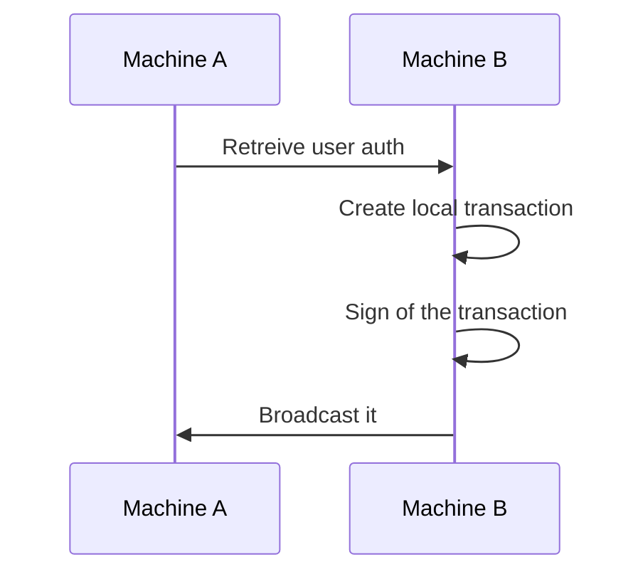
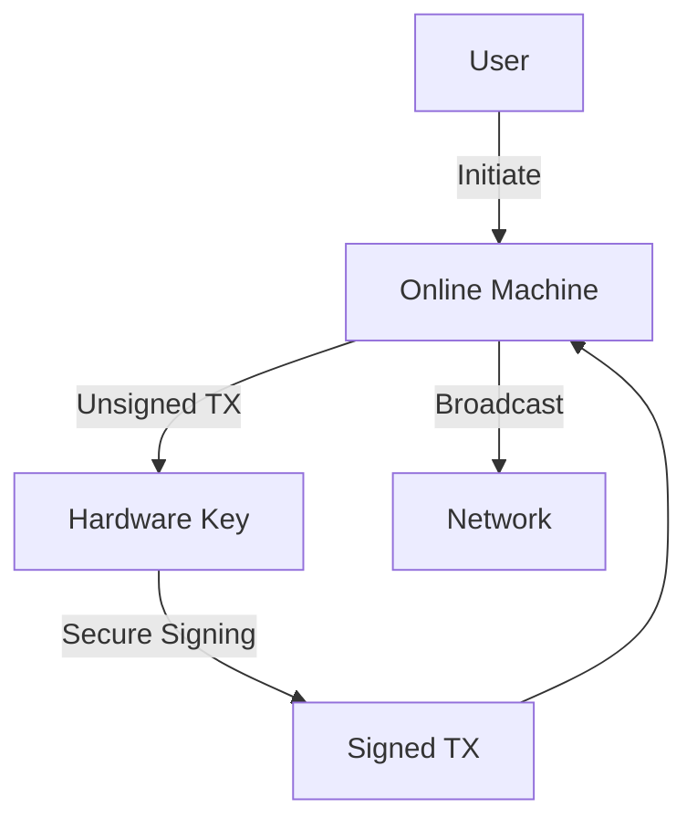

# 🛠️ Airgap transactions
## Secure your transaction with Gnokey

<!--
Gnokey is the primary CLI tool for interacting with Gno chains
Handles key management, transaction signing, and querying
-->

---

# Why using safer transaction? 

**Risks of Signing in an Online environment**:
- 🔑 Memory scraping attacks
- ⌨️ Keyloggers capturing passwords
- 🌐 MITM transaction hijacking
- 📧 Phishing fake transaction prompts

---
layout: top-title
color: purple
---

:: title ::
# 🔒 Airgap Transactions
:: content ::

## Secure Workflow

// Graph of the workflow

---

## 🛡️ Hardware Keys

### When Airgap Isn't Practical

✅ **Hardware Key Advantages**:
- 🔐 Private keys never leave secure element
- 🔒 Physical confirmation required
- 🛡️ Tamper-resistant design
- 🧪 Immune to computer malware
- 🔋 Portable security

💡 **Recommended Hardware**:
- Ledger Nano series
- Trezor Model T
- YubiKey 5 Series
- Gnosis Safe hardware modules
- AirGap Vault (mobile-based)

