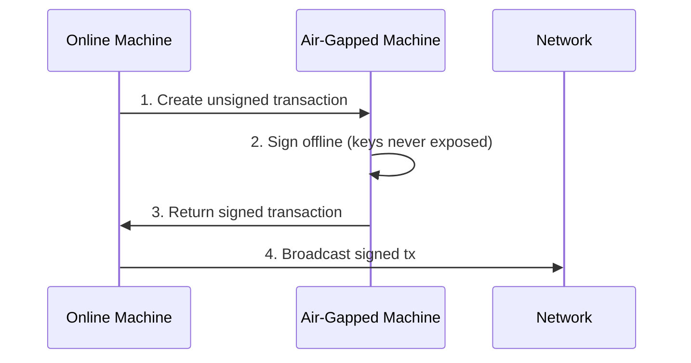
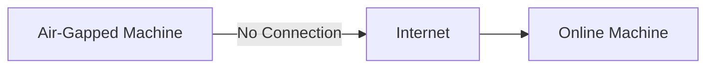
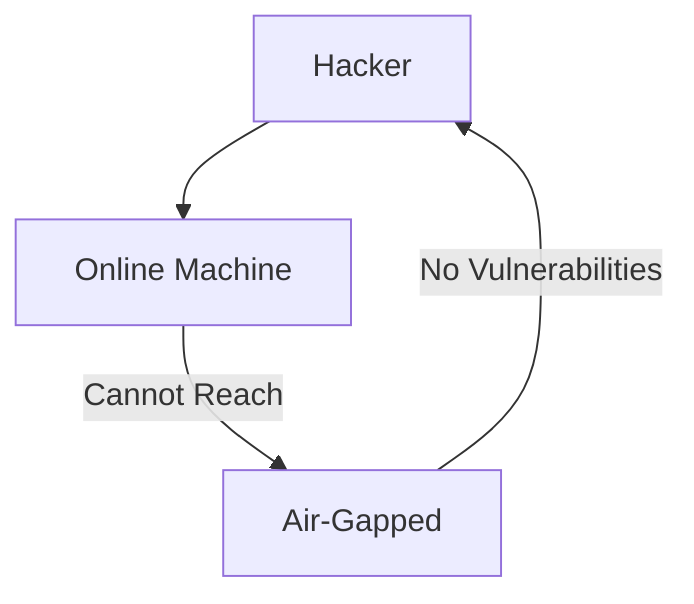

# 🛠️ Mastering Gnokey
## Essential CLI for Gno.land

Key management, transactions, and queries
Advanced features for power users

<!--
Gnokey is the primary CLI tool for interacting with Gno chains
Handles key management, transaction signing, and querying
-->

---

# 🛠️ What is Gnokey?


### The Essential CLI Tool for:
- 🔑 Key management
- 💰 Coin transfers
- 🔍 Blockchain queries
- 📡 Smart contract interactions


---
layout: top-title-two-cols 
color: sky-light
---

:: title ::
# 📡 Core Operations
:: left ::


#### Query
Read-only state inspection  
```bash
gnokey query vm/qrender \
  --data "gno.land/r/demo/boards"
```

- ✅ No gas cost - Safe for exploration


:: right ::

#### Call
Execute realm functions  
```bash
gnokey maketx call \
  --func "Transfer" \
  --args "g1abc.." --args "1000"
```
<div class="ns-c-tight">

- ⚠️ Uses gas  
- 📦 For predefined interactions
</div>

#### Run
Execute custom scripts  
```bash
gnokey maketx run ./script.gno
```

<div class="ns-c-tight">

- ⚠️ Uses gas  
- ✨ Flexible complex operations  
- 🧪 Supports loops and custom logic
</div>

---
layout: top-title-two-cols 
color: sky-light
---

:: title ::
# 📡 Core Operations
:: left ::

#### Send
Coin transfers  
```bash
gnokey maketx send \
  --to g1xyz.. --send "100ugnot"
```

- ⚠️ Uses gas  
- ⚡️ Direct banker module access

:: right ::

#### Addpkg 
Deploy code
```bash
gnokey maketx addpkg \
  --pkgpath "gno.land/p/myapp" \
  --pkgdir "./mycode"
```

- ⚠️ das  


---
layout: top-title
color: purple
---

:: title ::
# 🔒 Airgap Transactions
:: content ::

### Secure Workflow for Sensitive Operations



<div class="grid grid-cols-2 gap-4 mt-6">
<div class="bg-green-50 p-4 rounded border-l-4 border-green-400">
✅ Step-by-step:
1. `gnokey maketx ... > unsigned.tx`
2. `gnokey sign --tx unsigned.tx`
3. Transfer signed.tx to online machine
4. `gnokey broadcast signed.tx`
</div>

<div class="bg-purple-50 p-4 rounded border-l-4 border-purple-400">
🔐 Security Advantages:
- Private keys never touch internet
- Isolated signing environment
- Protection against remote attacks
- Physical transfer required
</div>
</div>

---
layout: top-title
color: emerald
---

:: title ::
# 🛡️ Why Airgap is Secure
:: content ::

<div class="grid grid-cols-2 gap-8">
<div>

### 🔐 Private Key Protection

- Keys generated and stored offline
- Zero network exposure
- Physical separation
</div>

<div>

### 🛡️ Attack Surface Reduction

- Malware cannot access signing device
- No remote execution possible
- Transaction verification before signing
</div>
</div>

<div class="mt-8 bg-amber-50 p-4 rounded border-l-4 border-amber-400">
⚠️ Critical for: Exchange operations, large transfers, and governance actions
</div>
