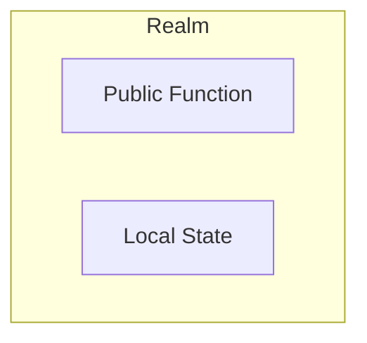
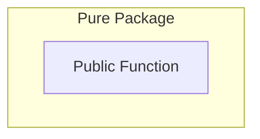
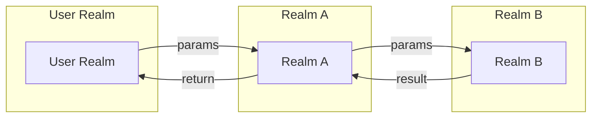
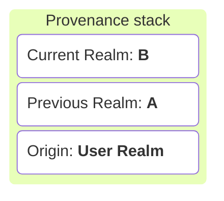
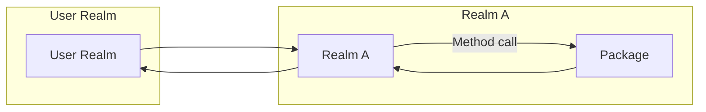
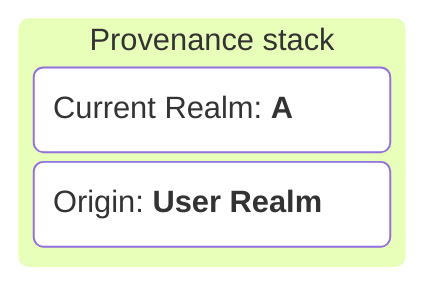
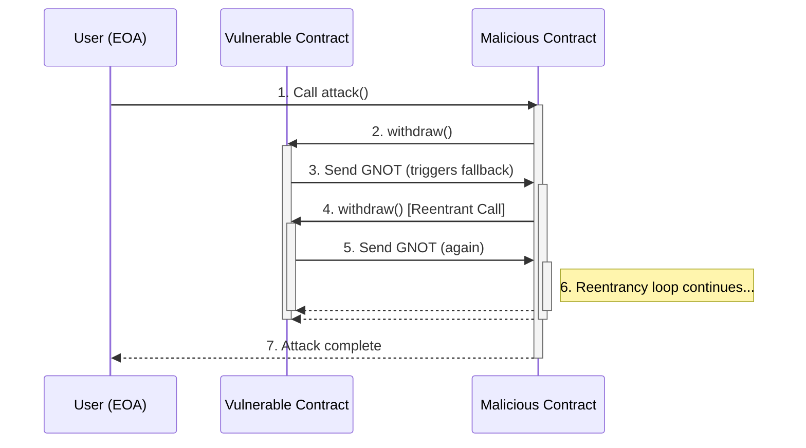
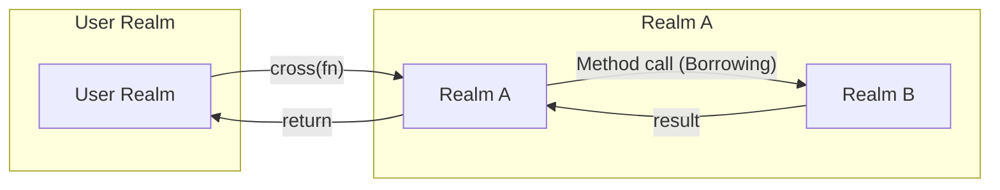
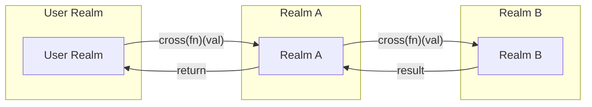
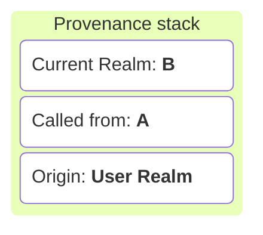

# Interrealm in Gno 🌐

A deep dive into Gno’s realm system and rules

<!--
Interrealm is a specification in Gno that add a synthax to explicit the realm context modification.
It protects users by avoiding implicit realm scope modification, that could led to unseen reentrency attack.
Let's see what is it, highlight the security benifits and understand the interrealm behavior.

Added in master.2250
-->

---

# What is a Realm?

* A **Realm** is an isolated mutable state space within the GnoVM
* Each realm:
  - Owns its global variables (storage)
  - Controls mutation access through realm context
  - Has a dedicated coin address

<div class="grid grid-cols-2 gap-4">

<div>



</div>

<div>



</div>

</div>

 <!-- 
Multi-context virtual machine
Each realm is fully isolated and self-governed, like a container.

You would need to do a context change, which can be compared to machine context in distributed computing.

 --> 

---

# Interrealm Flow

### Realm method call





---

# Interrealm Flow

### Pure Package method call




---

# But it instaure crucial flaw - Reentrency attack



---

# Let's introduce **Borrowing**
### Less permissive call for a more secure environment.

* **Borrowing** = calling a method on an external realm's object
* You temporarily enter the object's storage realm
* You can modify:
  - The receiver object itself
  - Objects reachable from receiver (same realm)
* **Cannot** create new root-level objects

---

# Interrealm Flow (Borrowing)




---

# Crossing

* **Explicitly switch** into another realm.
* **Crossing** = `cross(fn)(...)`.
* Gain full **write access** to the realm’s global storage like it used to.
* Use for **creating new objects** or performing realm-specific logic.

---


# Interrealm Flow (Crossing)




---

# Inter-realm Flow (Crossing)

#### Realm A
````md magic-move
```go
realmB.CreatePost("Hello Gno")
```
```go
realmB.CreatePost(cross, "Hello Gno")
```
````

#### Realm B
````md magic-move
```go
func CreatePost(title string) {
	newPost := Post{
		Title: title,
  }
	Posts = append(Posts, *newPost)
}
```
```go
func CreatePost(cur realm, title string) {
	newPost := Post{
		Title: title,
  }
	Posts = append(Posts, *newPost)
}
```
````
---

# Rules Summary

| Action                        | Borrowing                 | Crossing                        |
| ----------------------------- | ------------------------- | ------------------------------- |
| Modify existing object        | ✅ via method call         | ✅                               |
| Create new unattached object  | ❌                         | ✅                               |
| Implicit realm context change | No (temporary for method) | Yes (permanent inside fn)       |
| Method syntax                 | `obj.Method()`            | `cross(fn)(...)` + `cur realm` parameter |

---

# Code Example
## Borrowing

```go
// In realmB
func (b *Book) SetTitle(new string) {
  b.Title = new  // Allowed: borrowing b’s realm
}

// In realmA
book := &realmB.Book{}
book.SetTitle("Hello Gno")
```

## Crossing

```go
// In realmB
func CreateUser(cur realm, name string) {
  user := &User{Name: name}
  users[name] = user  // Global storage in realmB
}

// In realmA
realmB.CreateUser(cross, "alice")
```
---

# Summary

* **Realms** = isolated code.
* **Borrowing** = temporary, limited scoped access 
* **Crossing** = explicit realm switch for full access 
* Choose the right approach for **security** and **clarity**.

