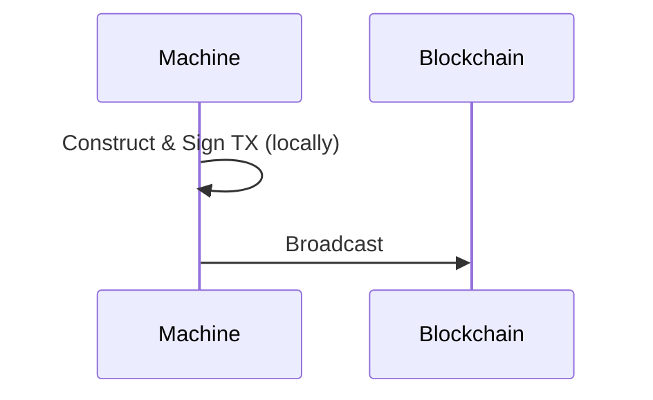
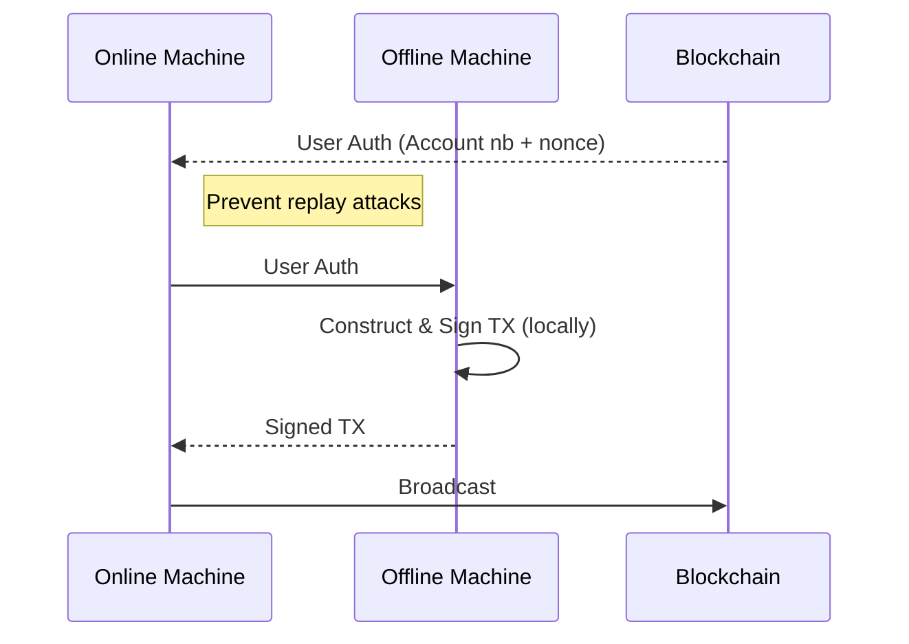
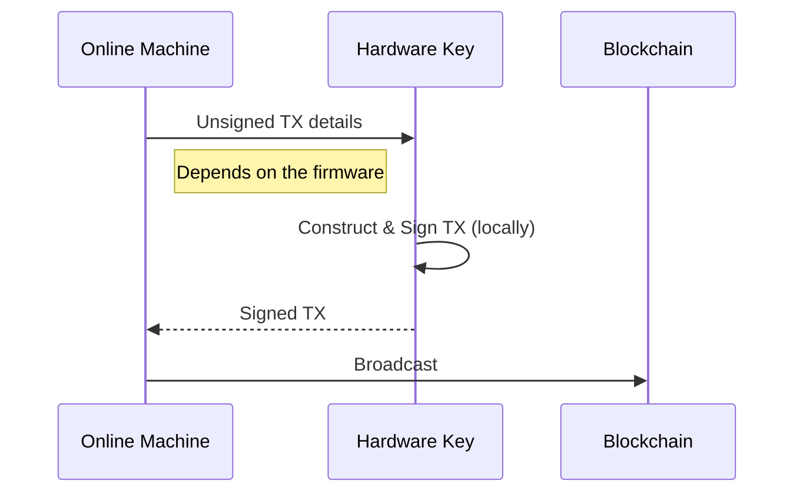
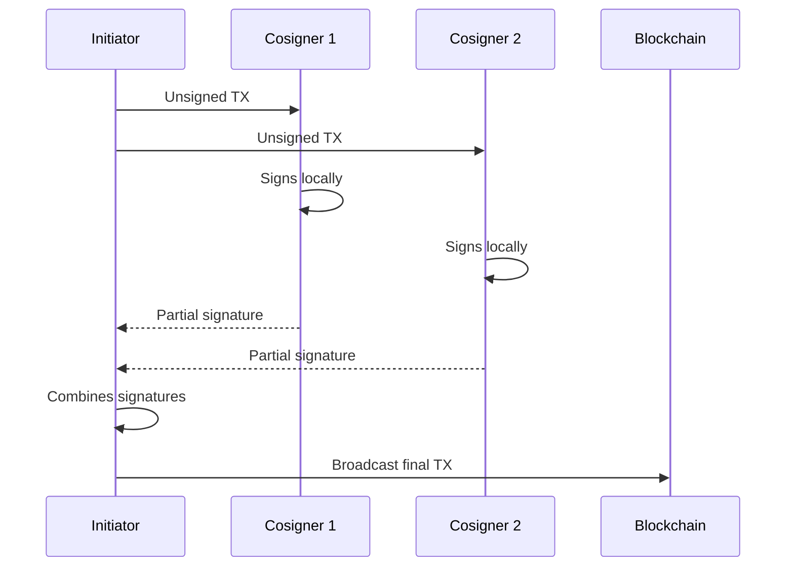

# 🛠️ Secure transaction
## Airgap tx and Hardware key

<!--
Gnokey is the primary CLI tool for interacting with Gno chains
It handles key management, transaction signing, and querying
Let's explore the secure way to interact with Gnoland by using Airgap tx and Hardware keys.
-->

---
layout: top-title
color: green
---

:: title ::
# 🔑 How to do a Transactions?
:: content ::

---

# Why using safe transaction? 

**Risks of Signing in an Online environment**:
- 🔑 Memory scraping attacks
- ⌨️ Keyloggers capturing passwords
- 🌐 MITM transaction hijacking
- 📧 Phishing fake transaction prompts
- ...

<!--
When signing in an online environment, you risk 

-->

---
layout: top-title
color: purple
---

:: title ::
# 🔒 Airgap Transactions
:: content ::

<!--
What is an airgap transaction?

-->

---
layout: top-title
color: blue
---

:: title ::
# 🛡️ Hardware Keys
:: content ::

<!--
What is an hardware key?

✅ **Hardware Key Advantages**:
- 🔐 Private keys never leave secure element
- 🔒 Physical confirmation required
- 🛡️ Tamper-resistant design
- 🧪 Immune to computer malware
- 🔋 Portable security
-->

---
layout: top-title-two-cols
color: orange
---

:: title ::
# Hardware Key vs Airgap Transaction

:: left ::
## 🛡️ Hardware Key
**Pros:**

- Instant signing process
- Private keys never exposed
- Portable (works with any computer)
- Tamper-proof hardware
- Physical confirmation required

**Cons:**

- Hardware cost 💰
- Limited to supported blockchains
- Firmware updates needed

:: right ::
## 🔒 Airgap Transaction
**Pros:**

- Works with any offline device
- No special hardware needed
- Flexible for any blockchain
- Complete network isolation
- Can store multiple key types

**Cons:**

- Multi-step process
- Requires data transfer method
- Dependent on offline device security
- Manual setup complexity

---
layout: top-title
color: light
---

:: title ::
# Possible Setup

:: content :: 
#### Hardware Key - Recommended way ✅
- Ledger, Trezor, YubiKey, ...

#### AirGap Vault - Secure but inconvenient 🔒
- Mobile based 
- VM based 
- Hardware based 

#### Native Way - Convenient but vulnerable 🏪
- Gnokey

---
layout: top-title
color: purple
---

:: title ::
# ✍️ Multi-Signature Setup
:: content ::

<!--

Code part - What to demonstrate:

- How to do a simple transaction
- How to do an airgap transaction (in local)
- In a VM
- Hardware key
- Multi-sign
-->