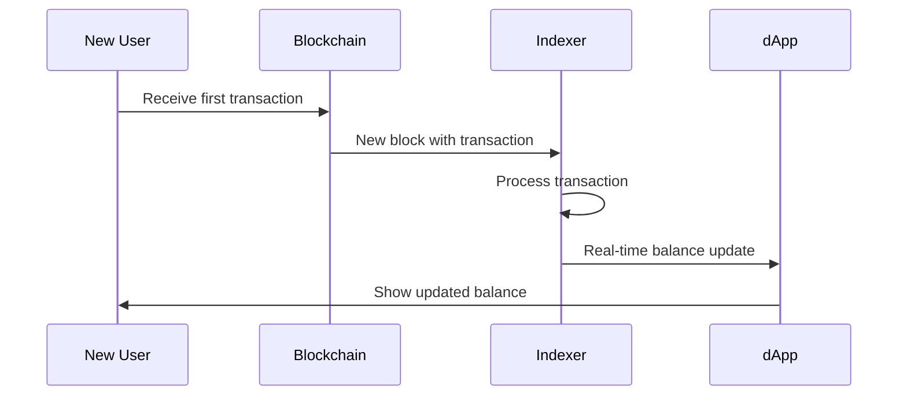
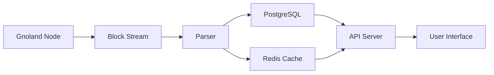

# 🚀 Gnolang Transaction Indexer  
### Real-time Blockchain Data Processing

How tx-indexer transforms raw blockchain data  
Into query-friendly structured information

---

# 🤔 What is a Blockchain Indexer?

<div class="grid grid-cols-2 gap-8">
<div>

### 🧱 Raw Blockchain Data
```json
{
  "height": 12345,
  "txs": [
    {
      "hash": "0x3F86...D9A1",
      "sender": "g1...abc",
      "receiver": "g1...xyz",
      "amount": "100ugnot"
    }
  ]
}
```
</div>
<div>

### 🔍 Indexer Transforms Data
```json
{
  "address": "g1...xyz",
  "balance": "250ugnot",
  "tx_count": 5,
  "first_seen": "2023-10-01"
}
```
</div>
</div>

**Indexer = Database + Search Engine for Blockchain**  
Transforms raw chain data into query-friendly format

---

# 🧾 Use Case: New User Balance



---

# 🧾 Use Case: New User Balance

1. User receives first transaction
2. Indexer detects new address
3. Calculates starting balance
4. Updates database in real-time
5. dApp displays accurate balance immediately

---

# ⚙️ How tx-indexer Works



1. **Ingest**: Listens to new blocks
2. **Parse**: Extracts transactions and accounts
3. **Store**: Saves structured data to database
4. **Serve**: Provides query API for dApps

