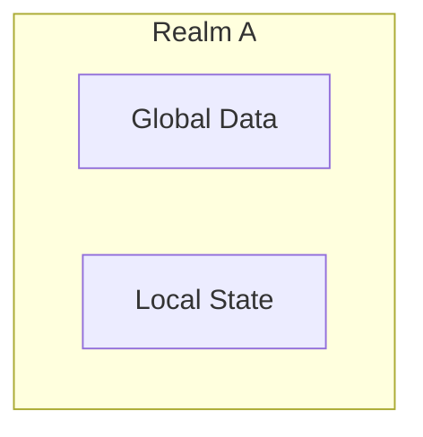
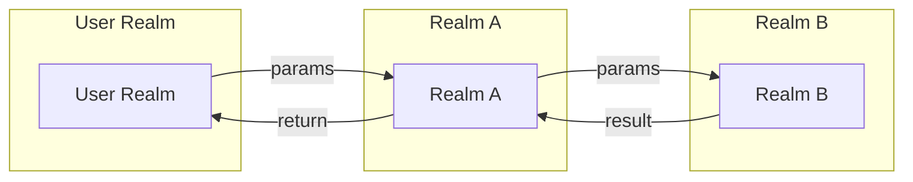
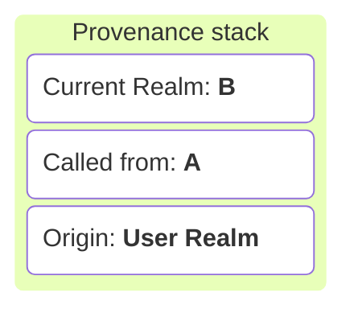
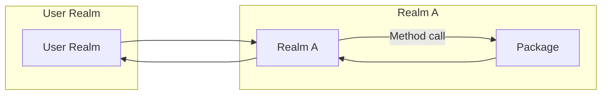
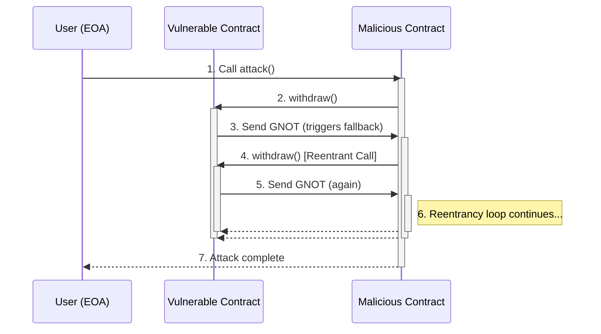
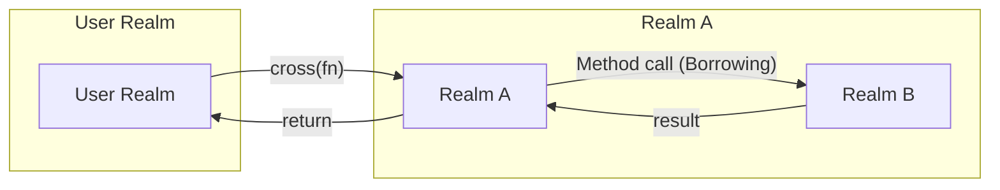
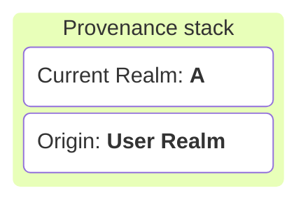
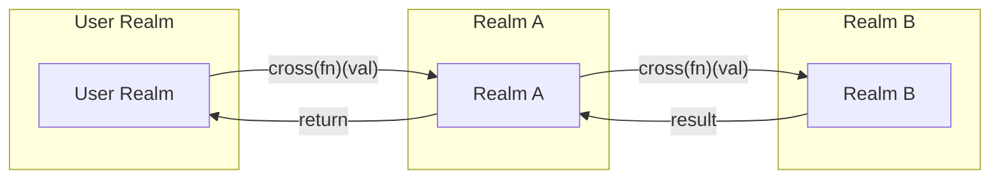

# Interrealm in Gno 🌐

A deep dive into Gno’s realm system and rules

<!--
Added in master.2250

Define what a realm is: isolated state and logic. 
Highlight benefits like security, traceability, and logical isolation. 
This sets the foundation for understanding interrealm behavior.
-->

---

# What is a Realm?

* A **Realm** is an isolated mutable state space within the GnoVM
* Each realm:
  - Owns its global variables (storage)
  - Controls mutation access through realm context
  - Has a dedicated coin address


 <!-- 
Show how realm A can call into realm B. Emphasize the layered provenance stack.

Realms are like smart contract containers — fully isolated and self-governed.
Think secure micro world.
 --> 

---

# Interrealm Flow

### Realm method call





---

# Interrealm Flow

### Package method call



---

# But it instaure crucial flaw - Reentrency attack



---

# Let's introduce **Borrowing**
### Less permissive call for a more secure environment.

* **Borrowing** = calling a method on an external realm's object
* You temporarily enter the object's storage realm
* You can modify:
  - The receiver object itself
  - Objects reachable from receiver (same realm)
* **Cannot** create new root-level objects

---

# Interrealm Flow (Borrowing)






---

# Crossing

* **Explicitly switch** into another realm.
* **Crossing** = `cross(fn)(...)` or functions marked with `crossing()`.
* Gain full **write access** to the realm’s global storage like it used to.
* Use for **creating new objects** or performing realm-specific logic.

---


# Interrealm Flow (Crossing)




---

# Inter-realm Flow (Crossing)

#### Realm A
````md magic-move
```go
realmB.CreatePost("Hello Gno")
```
```go
realmB.CreatePost(cross, "Hello Gno")
```
````

#### Realm B
````md magic-move
```go
func CreatePost(title string) {
	newPost := Post{
		Title: title,
	}
	Posts = append(Posts, *newPost)
}
```
```go
func CreatePost(cur realm, title string) {
	newPost := Post{
		Title: title,
  }
	Posts = append(Posts, *newPost)
}
````
---

# Rules Summary

| Action                        | Borrowing                 | Crossing                        |
| ----------------------------- | ------------------------- | ------------------------------- |
| Modify existing object        | ✅ via method call         | ✅                               |
| Create new unattached object  | ❌                         | ✅                               |
| Implicit realm context change | No (temporary for method) | Yes (permanent inside fn)       |
| Method syntax                 | `obj.Method()`            | `cross(fn)(...)` + `crossing()` |

---

# Code Example: Borrowing

```go
// In realmB
func (b *Book) SetTitle(new string) {
  b.Title = new  // Allowed: borrowing b’s realm
}

// In realmA
book := &realmB.Book{}
book.SetTitle("Hello Gno")
```

---

# Code Example: Crossing

```go
// In realmB
func CreateUser(cur realm, name string) {
  user := &User{Name: name}
  users[name] = user  // Global storage in realmB
}

// In realmA
realmB.CreateUser(cross, "alice")
```
---

# Summary

* **Realms** = isolated code.
* **Borrowing** = temporary, object-scoped access (Object operations)
* **Crossing** = explicit realm switch for full access (Public mutators)
* Choose the right approach for **security** and **clarity**.

