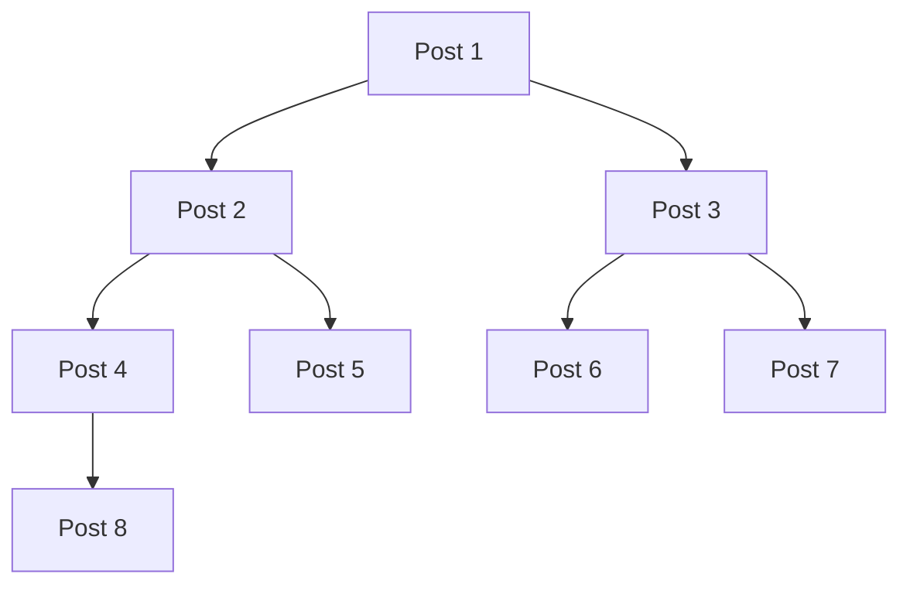
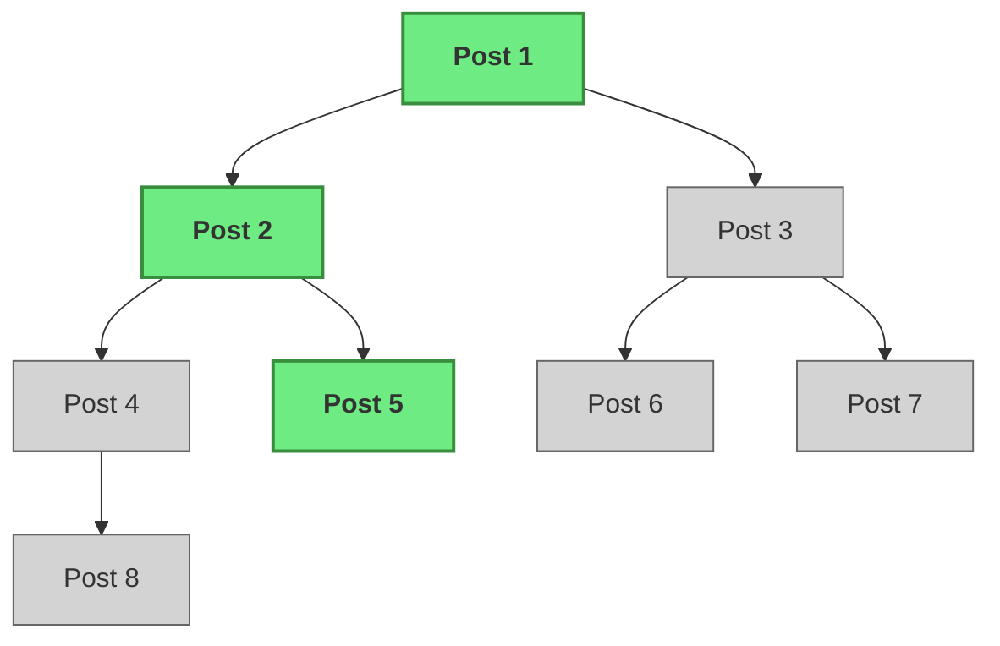

# 🌳 `avl.tree` vs `map` in Gno

Why `map` is not suitable for efficient dynamic on-chain storage\
How Gno’s `avl.Tree` powers an efficient alternative

<!--
Speaker Notes:
Avl tree has been everywhere in gno.
We'll explore how each data structure functions within Gno's realm environment, their advantages, and when to use one over the other.
-->

---
layout: center
---

# Let's say we have a blog

---
layout: top-title
color: violet
---
:: title::
# 📚 Use Case: Blog Posts with `map`
:: content ::


---
layout: top-title
color: violet
---
:: title::
# 📚 Use Case: Blog Posts with `map`
:: content ::


### ⚠️ More memory usage = More gas usage ! 


---
layout: top-title
color: violet
---
:: title::
# 📚 Use Case: Blog Posts with `map`
:: content ::


### 🤯 Unlimited gas usage


---
layout: top-title
color: lime
---
:: title::
# 📚 Use Case: Blog Posts with `avl.tree`
:: content ::




---
layout: top-title
color: lime
---
:: title::
# 📚 Use Case: Blog Posts with `avl.tree`
:: content ::




---
layout: top-title
color: lime
---
:: title::
# 📚 Use Case: Blog Posts with `avl.tree`
:: content ::


<!--
// show example of storage use case
From episode 2, take same example

Implementation first with maps
Then avl tree
-->

---
layout: side-title
titlewidth: is-3
color: violet-light
side: l
---
:: title ::
# 🗺️ Maps
:: content ::

# In-memory key/value structure
<br/>

### ✅ Pros
- Good for small, fixed-size data
- Simple syntax

### ❌ Cons
- Not scalable: All data is kept in memory
- High gas cost for large datasets

```go
var data = make(map[string]string)
data["key"] = "value"
```

<!--
Map is a linear key / value data structure
Straightforward to use and offer quick access times. 

It load its data entirely into memory, leading to scalability issues. 
can lead to out-of-gas errors in large-scale applications.

-->


---
layout: side-title
titlewidth: is-3
color: lime-light
side: l
---
:: title ::
# 🌲 AVL Trees
:: content ::
# Self-balancing binary search tree
<br/>

### ✅ Pros
  * Efficient memory usage
  * Suitable for large datasets

### ❌ Cons
  * O(log n) access times

```go
import "gno.land/p/demo/avl"

var tree avl.Tree
tree.Set("key", "value")
value := tree.Get("key")
```

<!--
Speaker Notes:
AVL Trees, provide longer access time but handle large datasets more efficiently by only charging the necessary.
Scalability and determinism, make them preferable in many scenarios.

Avl tree are self-balancing binary search trees, with their both side of the same deep.
That's how they can achieve it

-->

---
layout: top-title
color: sky
---
:: title ::
# ⚖️ Comparison: `Map` vs `avl.Tree`
:: content ::

| Operation   | **Map** (Small Data) | **AVL Tree** (Large Data) |
| ----------- | ---------------- | --------------------- |
| Lookup      | O(1)             | O(log n)              |
| Insert      | O(1)             | O(log n)              |
| Delete      | O(1)             | O(log n)              |
| Scalability | Poor             | Excellent             |


---

# 🧠 When to Use What?

* **Use Maps when:**
  * Working with small constant datasets

* **Use AVL Trees when:**
  * Dealing with dynamic datasets
  * Scalability and efficiency are required

---

# 📚 Further Reading

* [Why use AVL Trees in Gno](https://gno.howl.moe/avl-tree-storage/)
* [Gno AVL Tree Documentation](https://docs.gno.land/resources/glossary)
* [Effective Gno](https://docs.gno.land/resources/effective-gno/)

<!--
Speaker Notes:
For more in-depth information, consider reading these resources. They provide detailed explanations and examples of using AVL Trees in Gno.
-->

