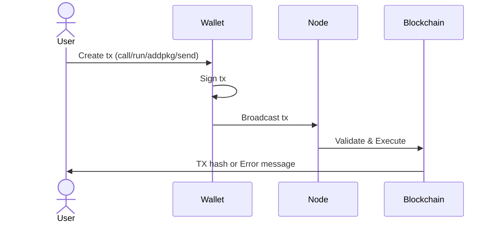

# ⚡ Gnoland Transaction Types  
## Understanding `call`, `run`, `addpkg` and `send`

How to interact with the Gno blockchain

---

# 🔄 What are Transactions?


**Blockchain Interactions**
- 📝 Signed operations
- 📦 Change blockchain state
- 🔐 Require gas fees
- 🌐 Must be broadcasted to be on network


---

# 📦 Transaction Types Overview

<div class="overflow-x-auto">
<table class="w-full">
<thead class="bg-gray-100">
  <tr>
    <th class="p-3 text-left">Type</th>
    <th class="p-3 text-left">Command</th>
    <th class="p-3 text-left">Purpose</th>
  </tr>
</thead>
<tbody>
  <tr class="border-b hover:bg-blue-50">
    <td class="p-3 font-bold">📞 Call</td>
    <td class="p-3 font-mono">maketx call</td>
    <td class="p-3">Execute specific function</td>
  </tr>
  <tr class="border-b hover:bg-green-50">
    <td class="p-3 font-bold">🏃 Run</td>
    <td class="p-3 font-mono">maketx run</td>
    <td class="p-3">Execute entire script</td>
  </tr>
  <tr class="border-b hover:bg-purple-50">
    <td class="p-3 font-bold">📦 AddPkg</td>
    <td class="p-3 font-mono">maketx addpkg</td>
    <td class="p-3">Deploy new contract</td>
  </tr>
  <tr class="border-b hover:bg-amber-50">
    <td class="p-3 font-bold">💸 Send</td>
    <td class="p-3 font-mono">maketx send</td>
    <td class="p-3">Transfer coins</td>
  </tr>
</tbody>
</table>
</div>

---
layout: default
---

# 📞 <span class="text-blue-500">Call</span> Transactions
## Execute Specific Functions

````md magic-move
```bash {all|1|3|4|5|7-9|11-12|all}
gnokey maketx call \
  # Required parameters
  --pkgpath "gno.land/r/demo/boards" \
  --func "CreateThread" \
  --args "Crypto" \

  # Gas fees
  --gas-fee 1gnot \
  --gas-wanted 10000 \

  # Key
  mykeyname # or address e.g.: g1tdqr....
```
```bash
gnokey maketx call \
  --pkgpath "gno.land/r/demo/boards" \
  --func "CreateThread" \
  --args "Crypto" \
  --gas-fee 1gnot \
  --gas-wanted 10000 \
  mykeyname
```
````

---
layout: default
---

# 🏃 <span class="text-green-500">Run</span> Transactions
## Execute Complete Scripts

```bash {all|2-4|6-7|9-10|all}
gnokey maketx run \
  # Gas fees
  --gas-fee 1gnot \
  --gas-wanted 10000 \

  # Key
  mykeyname \

  # Transaction Script
  ./myscript
```

---
layout: default
---

# 📦 <span class="text-purple-500">AddPkg</span> Transactions
## Deploy New Realm

```bash {all|3|4|5|7-10|all}
gnokey maketx addpkg \
  # Required parameters
  --pkgpath "gno.land/r/demo/token" \
  --pkgdir "." \
  --deposit "1000gnot" \

  # Gas fees + Key
  --gas-fee 1gnot \
  --gas-wanted 10000 \
   mykeyname
```

---

# 💸 <span class="text-amber-500">Send</span> Transactions  
## Transfer Native Currency

```bash {all|2-4|3|4|6-9|all}
gnokey maketx send \
  # Required parameters
  --send "100gnot" \
  --to g1qkm0xhj8nsm2l3g50ttazxhlq7fs47myhxqk79 \

  # Gas fees + Key
  --gas-fee 1gnot \
  --gas-wanted 10000 \
   mykeyname
```

---

# 🔄 Transaction Lifecycle



---


# 📡 Broadcasting Transactions

**Required Flags for Every Broadcast:**
```bash {1,2,3|1|2|3|all}
--broadcast             # Enable network transmission
--chainid "testchain"   # Specify blockchain network
--remote "localhost:26657" # Connect to node RPC
```


---

# 🛠 Practical Examples


**1. Deploy Contract**
```bash
gnokey maketx addpkg --pkgpath "gno.land/r/mydapp/token" --gas-fee 1gnot --gas-wanted 10000 \
  --broadcast --chainid "staging" --remote "https://rpc.gno.land:443" key
```

**2. Mint Tokens**
```bash
gnokey maketx call --pkgpath "gno.land/r/mydapp/token" --func "Mint" --gas-fee 1gnot --gas-wanted 10000 \
  --broadcast -chainid "dev" -remote "tcp://127.0.0.1:26657" key
```

**3. Run Setup Script**
```bash
gnokey maketx run ./script.gno --gas-fee 1gnot --gas-wanted 10000 \
  --broadcast -chainid "dev" -remote "tcp://127.0.0.1:26657" key
```

**4. Transfer Funds**
```bash
gnokey maketx send --to g1friendaddress --send "50gnot" --gas-fee 1gnot --gas-wanted 10000 \
  --broadcast --chainid "staging" --remote "https://rpc.gno.land:443" key
```
---

# 📚 Resources & Next Steps

**Official Documentation**  
[gno.land Transactions Guide](https://docs.gno.land/users/interact-with-gnokey/)  

```bash
# View help for all commands
gnokey maketx --help
```

<div class="mt-8 text-center text-xl">
🚀 <strong>Master transactions to unlock Gnoland's full potential!</strong>
</div>
