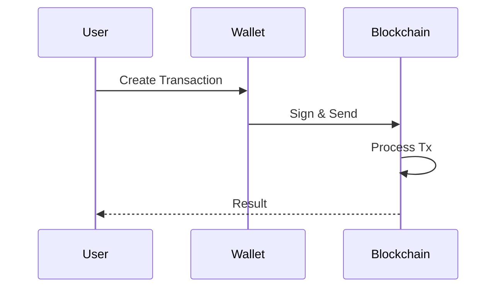
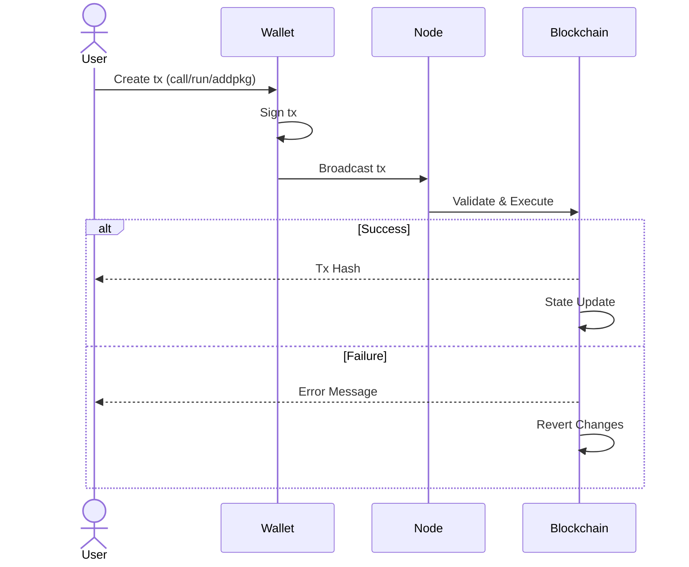

# ⚡ Gnoland Transaction Types  
## Understanding `call`, `run`, `addpkg` and more

How to interact with the Gno blockchain

---

# 🔄 What are Transactions?

<div class="grid grid-cols-2 gap-8 mt-6">
<div>

**Blockchain Interactions**
- 📝 Signed operations
- 🔐 Require gas fees
- 📦 Change blockchain state

<br>

**Key Components:**
1. Sender (signer)
2. Action (`call`, `run`, etc.)
3. Arguments
4. Gas fee

</div>
<div class="text-center">



</div>
</div>

---

# 📦 Transaction Types Overview

<div class="overflow-x-auto">
<table class="w-full">
<thead class="bg-gray-100">
  <tr>
    <th class="p-3 text-left">Type</th>
    <th class="p-3 text-left">Command</th>
    <th class="p-3 text-left">Purpose</th>
    <th class="p-3 text-left">State Change</th>
  </tr>
</thead>
<tbody>
  <tr class="border-b hover:bg-blue-50">
    <td class="p-3 font-bold">📞 Call</td>
    <td class="p-3 font-mono">maketx call</td>
    <td class="p-3">Execute specific function</td>
    <td class="p-3">✅ Permanent</td>
  </tr>
  <tr class="border-b hover:bg-green-50">
    <td class="p-3 font-bold">🏃 Run</td>
    <td class="p-3 font-mono">maketx run</td>
    <td class="p-3">Execute entire script</td>
    <td class="p-3">❌ Temporary</td>
  </tr>
  <tr class="border-b hover:bg-purple-50">
    <td class="p-3 font-bold">📦 AddPkg</td>
    <td class="p-3 font-mono">maketx addpkg</td>
    <td class="p-3">Deploy new contract</td>
    <td class="p-3">✅ Permanent</td>
  </tr>
  <tr class="border-b hover:bg-amber-50">
    <td class="p-3 font-bold">💸 Send</td>
    <td class="p-3 font-mono">maketx send</td>
    <td class="p-3">Transfer coins</td>
    <td class="p-3">✅ Permanent</td>
  </tr>
  <tr class="border-b hover:bg-teal-50">
    <td class="p-3 font-bold">⚙️ Exec</td>
    <td class="p-3 font-mono">maketx exec</td>
    <td class="p-3">Run local file</td>
    <td class="p-3">❌ Temporary</td>
  </tr>
  <tr class="border-b hover:bg-pink-50">
    <td class="p-3 font-bold">🔍 Query</td>
    <td class="p-3 font-mono">query</td>
    <td class="p-3">Read state</td>
    <td class="p-3">❌ Read-only</td>
  </tr>
</tbody>
</table>
</div>

<div class="mt-4 p-4 bg-gray-100 rounded-lg">
💡 <strong>Key Difference:</strong> Permanent transactions change blockchain state, temporary transactions don't persist
</div>

---
layout: default
---

# 📞 <span class="text-blue-500">Call</span> Transactions
## Execute Specific Functions

```bash {all|1-3|4-5|all}
gnokey maketx call \
  --pkgpath "gno.land/r/demo/boards" \
  --func "CreateThread" \
  --args "Crypto" "Market News" "BTC up 10%" \
  --gas-fee 1gnot
```

<div class="grid grid-cols-2 gap-4 mt-6">
<div class="p-4 bg-blue-50 rounded border-l-4 border-blue-400">
✅ <strong>Use Cases</strong>
- Modify contract state
- Payable functions
- Gas-efficient
</div>

<div class="p-4 bg-red-50 rounded border-l-4 border-red-400">
⚠️ <strong>Limitations</strong>
- Must know function signature
- Package must be deployed
</div>
</div>

---
layout: default
---

# 🏃 <span class="text-green-500">Run</span> Transactions
## Execute Complete Scripts

```bash {all|1-3|4-5|all}
gnokey maketx run \
  --pkgpath "gno.land/r/demo/my_script" \
  --gas-fee 2gnot \
  --broadcast
```

<div class="grid grid-cols-2 gap-4 mt-6">
<div class="p-4 bg-green-50 rounded border-l-4 border-green-400">
✅ <strong>Use Cases</strong>
- One-time computations
- Script-like operations
- Initialize contracts
</div>

<div class="p-4 bg-red-50 rounded border-l-4 border-red-400">
⚠️ <strong>Limitations</strong>
- No persistent state
- Higher gas cost
</div>
</div>

---
layout: default
---

# 📦 <span class="text-purple-500">AddPkg</span> Transactions
## Deploy New Contracts

```bash {all|1-3|4-5|all}
gnokey maketx addpkg \
  --pkgpath "gno.land/r/myapp/mytoken" \
  --deposit "1000gnot" \
  --pkgdir "./mytoken" 
```

<div class="grid grid-cols-2 gap-4 mt-6">
<div class="p-4 bg-purple-50 rounded border-l-4 border-purple-400">
✅ <strong>Use Cases</strong>
- Deploy new realms
- Update existing packages
- Store contract code
</div>

<div class="p-4 bg-red-50 rounded border-l-4 border-red-400">
⚠️ <strong>Limitations</strong>
- Requires deposit
- Complex deployment
</div>
</div>

---

# ⚖️ Transaction Comparison

| Feature          | 📞 Call          | 🏃 Run           | 📦 AddPkg        |
|------------------|------------------|------------------|------------------|
| State Change     | ✅               | ❌ (Temporary)   | ✅               |
| Gas Cost         | Low              | Medium           | High             |
| Persistence      | Permanent        | Ephemeral        | Permanent        |
| Deployment       | Not required     | Not required     | Required         |
| Best For         | Contract methods | One-off scripts  | Deploying code   |

---

# 🔄 Transaction Lifecycle



---

# 🛠 Practical Examples

**1. Deploy a Token Contract**
```bash
gnokey maketx addpkg \
  --pkgpath "gno.land/r/mydapp/token" \
  --pkgdir "./token-contract"
```

**2. Mint New Tokens**
```bash
gnokey maketx call \
  --pkgpath "gno.land/r/mydapp/token" \
  --func "Mint" \
  --args "g1myaddress" "1000000"
```

**3. Run Setup Script**
```bash
gnokey maketx run \
  --pkgpath "gno.land/r/mydapp/setup" \
  --gas-fee 3gnot
```

---

# 🚨 Common Errors & Fixes

<div class="grid grid-cols-2 gap-4 mt-6">
<div class="p-4 bg-red-50 rounded-lg">
<strong>❌ "out of gas"</strong>
```bash
# Solution:
Increase gas:
--gas-wanted 2000000 \
--gas-fee 5gnot
```
</div>

<div class="p-4 bg-red-50 rounded-lg">
<strong>❌ "invalid pkgpath"</strong>
```bash
# Solution:
Verify exact path:
gno.land/r/demo/boards
```
</div>

<div class="p-4 bg-red-50 rounded-lg">
<strong>❌ "function not found"</strong>
```bash
# Solution:
Check function name:
--func "CreateBoard"
```
</div>

<div class="p-4 bg-red-50 rounded-lg">
<strong>❌ "insufficient deposit"</strong>
```bash
# Solution:
Add more funds:
--deposit "2000gnot"
```
</div>
</div>

---

# 💡 Pro Tips

1. **Dry Run First**
   ```bash
   gnokey maketx call ... --dry-run
   ```

2. **Estimate Gas**
   ```bash
   gnokey query estimate-gas --tx <tx-file>
   ```

3. **View Tx History**
   ```bash
   gnokey query txs --tags call
   ```

4. **Test Locally**
   ```bash
   gnokey maketx run --pkgpath localfile.gno
   ```

---

# 📚 Resources & Next Steps

**Official Documentation**  
[gno.land Transactions Guide](https://docs.gno.land/guides/transactions)  

**Next Steps:**
1. Try all transaction types
2. Build a full dApp workflow
3. Explore advanced gas management
4. Implement transaction batching

```bash
# View help for all commands
gnokey maketx --help
```

<div class="mt-8 text-center text-xl">
🚀 <strong>Master transactions to unlock Gnoland's full potential!</strong>
</div>