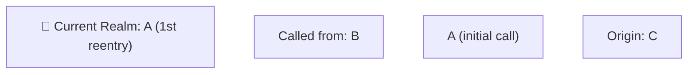
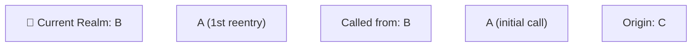
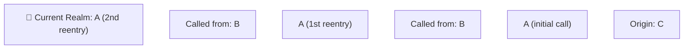
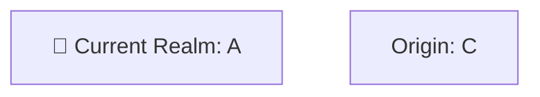

# Reentrancy Attack  
## Step-by-Step Call Stack Growth

---

# Step 1: Initial Call

```mermaid {v-click}
flowchart TD
  direction TB
  A1["🔴 Current Realm: A (initial call)"]
  C["Origin: C"]
````

🧠 C initiates a transaction.
Control enters A for the first time.

---

# Step 2: A calls B

```mermaid
flowchart TD
  direction TB
  B1["🔴 Current Realm: B"]
  A1["A (initial call)"]
  C["Origin: C"]
```

🧠 A makes an external call to B.
Control passes to B.

---

# Step 3: Reentrancy begins (B calls back into A)



⚠️ B reenters A before A1 finishes.
This is the start of the reentrancy.

---

# Step 4: A calls B again (nested)



🔁 Reentered A makes another external call to B.
Stack keeps growing.

---

# Step 5: B reenters A again



💣 Each reentry pushes a new frame.
This can repeat until the contract is drained or gas runs out.

---

# ⚠️ Vulnerability Summary

* Unprotected external calls allow reentrancy.
* Reentered frames can manipulate contract state **before the first call finishes**.
* This is how attackers exploit **inconsistent intermediate states**.

---

# ✅ Solution: Borrowing Pattern



✅ A executes logic internally, or via a borrowing-safe call (e.g., `{B()}`).
No external control is passed — stack stays flat.

---

# 🎉 End

* Avoid `external` calls unless necessary.
* Use **checks-effects-interactions** or **ReentrancyGuard**.
* Consider **borrowing or capability-safe designs** (e.g., packages, modules).

```

---
