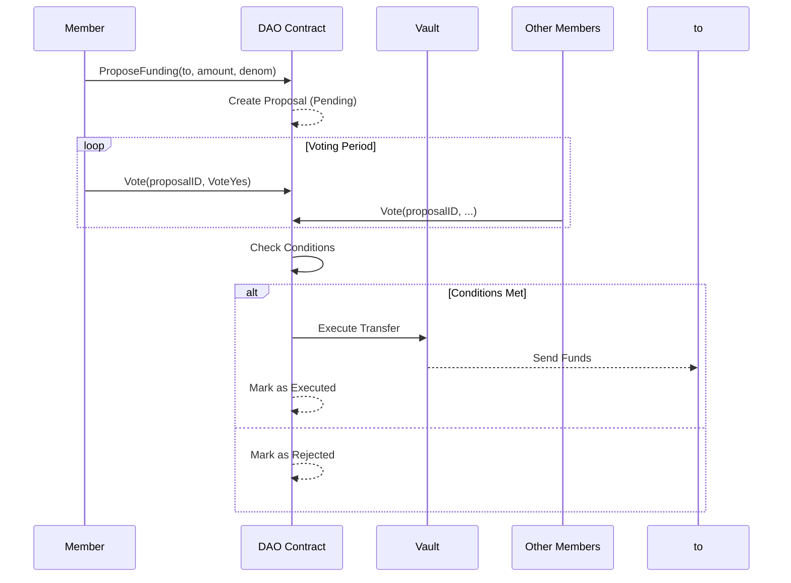

# DAOkit on Gno.land - Modular Governance Framework

DAOkit is a modular governance framework for building decentralized autonomous organizations (DAOs) on Gno.land. It provides composable components for creating custom governance systems with flexible voting mechanisms, role-based permissions, and resource management.

## Key Components

### 1. 🧱 basedao - Core DAO Management
Manages members, roles, and permissions:

```go
// Define roles
initialRoles := []basedao.RoleInfo{
    {Name: "admin", Description: "Admin is the superuser"},
    {Name: "finance-officer", Description: "Manages funds"},
}

// Define members
initialMembers := []basedao.Member{
    {Address: "g126...zlg", Roles: []string{"admin"}},
    {Address: "g1ld6...3jv", Roles: []string{"finance-officer"}},
}
```

### 2. ⚙️ daocond - Proposal Conditions
Create custom execution conditions for proposals:

```go
condition := daocond.And(
    daocond.MembersThreshold(0.6, memberStore.IsMember, memberStore.MembersCount),
    daocond.RoleCount(1, "finance-officer", memberStore.HasRole),
)
```

### 3. 📦 DAOkit - Proposal & Resource Management
Core functionality for proposal lifecycle:

```go
// Propose a new action
DAO.Propose(daokit.ProposalRequest{
    Title: "Fund Project X",
    Description: "Allocate 3 GNOT to Project X",
    Actions: []daokit.Action{fundAction},
})

// Vote on a proposal
DAO.Vote(proposalID, daocond.VoteYes)

// Execute approved proposal
DAO.Execute(proposalID)
```

## Governance Flow


## Use Cases

1. **Treasury Management**: 
   - Control fund allocation with multi-sig approvals
   - Set spending limits per proposal

2. **Protocol Upgrades**:
   - Govern smart contract changes
   - Manage protocol parameters

3. **Grant Programs**:
   - Community-funded development
   - Transparent fund distribution

4. **Role Management**:
   - Add/remove DAO members
   - Modify role permissions