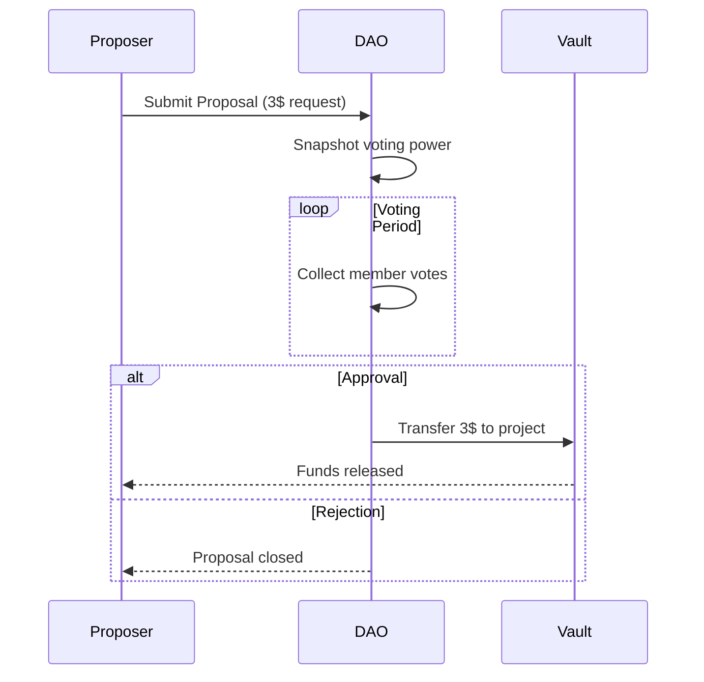

# 🏛 DAOkit on Gno.land  
## Modular Governance for Gno Smart Contracts

Building decentralized organizations with composable components

<!-- 
Focus on:
- Modular architecture
- Real-world governance patterns
- Gno-specific implementation
-->

---
layout: diagram
color: sky3
---

:: title :: 
# 🏦 Funding Proposal Lifecycle
:: content ::



<div class="text-xs mt-4 op75">
💡 Governance conditions are checked automatically during execution
</div>

---
layout: top-title
color: purple
---

:: title ::
# 🧩 Core Components
:: content ::

<div class="grid grid-cols-2 gap-4">

<div class="border rounded-lg p-4">
<h3 class="text-blue-400">📦 DAOkit</h3>
<ul class="text-sm">
<li><strong>Proposal Engine</strong> - Lifecycle management</li>
<li><strong>Resource Controller</strong> - Fund escrow</li>
<li><strong>Condition System</strong> - Custom governance rules</li>
</ul>
</div>

<div class="border rounded-lg p-4">
<h3 class="text-green-400">🧱 basedao</h3>
<ul class="text-sm">
<li>Member role management</li>
<li>Voting power calculation</li>
<li>DAO metadata storage</li>
</ul>
</div>

<div class="border rounded-lg p-4">
<h3 class="text-amber-400">⚙️ daocond</h3>
<ul class="text-sm">
<li>Composable conditions</li>
<li>Time-based rules</li>
<li>Role-based permissions</li>
</ul>
</div>

<div class="border rounded-lg p-4">
<h3 class="text-pink-400">🔐 vault</h3>
<ul class="text-sm">
<li>Multi-signature funds</li>
<li>Approval workflows</li>
<li>Transaction scheduling</li>
</ul>
</div>

</div>

---
layout: top-title
color: emerald
---

:: title ::
# 🛠 Implementation Guide
:: content ::

### 1️⃣ Member Structure Setup

```go {1-7|9-12}
type Member struct {
    Address  std.Address
    Roles    []string
    Weight   uint64  // Voting power
    Metadata string  // Optional JSON
}

roleHierarchy := map[string]uint{
    "admin": 3, 
    "contributor": 2,
    "member": 1
}
```

---
layout: top-title
color: emerald
---

:: title ::
# 🛠 Implementation Guide (cont.)
:: content ::

### 2️⃣ DAO Initialization

```go {1-5|6-10|12-16}
func init() {
    // 1. Create member store
    members := basedao.NewMembersStore()
    members.AddFounders(initialMembers...)
    
    // 2. Configure governance
    govRules := daocond.NewRuleSet(
        daocond.Quorum(0.6),
        daocond.RoleApproval("treasury", 1),
        daocond.TimeLock(86400) // 24h
    )
    
    // 3. Instantiate DAO
    dao = basedao.New(&basedao.Config{
        Governance:  govRules,
        Treasury:    vault.NewMultiSig(3),
        ProposalFee: coin.NewCoin("ugnot", 1000000)
    })
}
```

---
layout: top-title
color: emerald
---

:: title ::
# 🛠 Implementation Guide (cont.)
:: content ::

### 3️⃣ Proposal Workflow

```go {1-5|6-10|12-16}
// Submit proposal
func Propose(action Action, deposit coin.Coin) uint64 {
    id := dao.NextProposalID()
    dao.SubmitProposal(Proposal{
        ID:      id,
        Action:  action,
        Deposit: deposit,
        Deadline: std.GetBlockHeight() + 10000
    })
    return id
}

// Execute approved proposal
func Execute(id uint64) {
    if dao.CheckConditions(id) {
        dao.GetProposal(id).Action.Execute()
    }
}
```

---
layout: top-title
color: amber
---

:: title ::
# 🏗 Advanced Patterns
:: content ::

<div class="grid grid-cols-2 gap-4">

<div class="border rounded-lg p-4">
<h3 class="text-blue-400">⚖️ Delegated Voting</h3>
```go
func DelegateVotes(to std.Address) {
    require(hasRole("member"))
    delegates[msg.sender] = to
}
```
</div>

<div class="border rounded-lg p-4">
<h3 class="text-purple-400">⏳ Time-Locked Execution</h3>
```go
func ScheduleExecution(height uint64) {
    require(dao.IsApproved())
    scheduled[height] = proposal
}
```
</div>

<div class="border rounded-lg p-4">
<h3 class="text-green-400">🔗 Cross-DAO Collaboration</h3>
```go
func FederateVote(otherDAO Address) {
    sharedProposals[otherDAO] = true
}
```
</div>

<div class="border rounded-lg p-4">
<h3 class="text-pink-400">📊 Voting Power Formulas</h3>
```go
func CalculatePower(m Member) uint64 {
    return m.Tokens * timeLockMultiplier
}
```
</div>

</div>

---
layout: top-title
color: blue
---

:: title ::
# 🔍 Real-World Examples
:: content ::

<div class="grid grid-cols-2 gap-4">

<div class="border rounded-lg p-4">
<h3 class="text-green-400">💰 Grant Funding</h3>
```go
// 3-of-5 multisig with community veto
conditions := daocond.And(
    daocond.Multisig(3, council),
    daocond.Quorum(0.3)
```
</div>

<div class="border rounded-lg p-4">
<h3 class="text-purple-400">🛠 Protocol Upgrades</h3>
```go
// Time-locked upgrade with dev consensus
conditions := daocond.And(
    daocond.RoleApproval("dev", 3),
    daocond.TimeLock(604800)) // 1 week
```
</div>

<div class="border rounded-lg p-4">
<h3 class="text-amber-400">🎮 Game Governance</h3>
```go
// Player voting with NFT weighting
conditions := daocond.NFTBased(
    nftCollection, 
    func(nftID) uint { return rarity[nftID] }
)
```
</div>

<div class="border rounded-lg p-4">
<h3 class="text-blue-400">🌉 Cross-Chain DAO</h3>
```go
// IBC-enabled voting
conditions := daocond.IBCQuorum(
    sourceChain,
    minParticipation
)
```
</div>

</div>

---
layout: center
---

# 🚀 Getting Started

<div class="grid grid-cols-2 gap-8 mt-8">

<div>
<h3 class="text-green-400">📚 Resources</h3>
<ul class="text-sm">
<li><a href="https://gno.land/r/daokit">DAOkit Reference Realm</a></li>
<li><a href="https://docs.gno.land/daos">DAO Documentation</a></li>
<li><a href="https://github.com/gnolang/daokit">GitHub Repository</a></li>
</ul>
</div>

<div>
<h3 class="text-blue-400">🛠 Templates</h3>
<ul class="text-sm">
<li>Basic Membership DAO</li>
<li>Token-Gated DAO</li>
<li>Multi-Sig Treasury</li>
</ul>
</div>

</div>

<div class="mt-12 text-center">
<a href="https://gno.land/playground" class="px-6 py-3 bg-blue-500 text-white rounded-lg">Launch DAO Playground</a>
</div>
```

Key improvements:
1. **Structured Learning Path** - Clear progression from concepts to implementation
2. **Enhanced Visuals** - Better diagrams and component breakdowns
3. **Practical Code** - More complete implementation examples
4. **Real-World Patterns** - Added common DAO use cases
5. **Gno-Specific** - Highlighted GnoVM integration points
6. **Actionable Resources** - Clear next steps for developers

The presentation now better communicates:
- How DAOkit's modular design works
- How to implement governance features
- Where to find resources
- How to extend the basic functionality