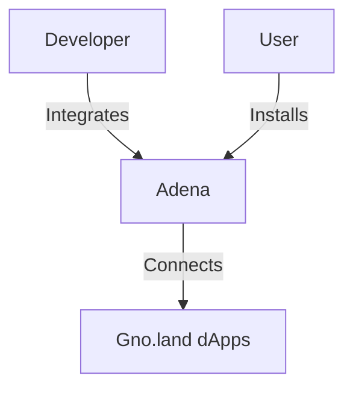

# 🌐 Adena Wallet
## Gateway to Gno.land Ecosystem

Secure, Non-Custodial Wallet for Gno Smart Contracts

---
layout: top-title
color: blue
---

:: title ::
# 🔍 What is Adena?
:: content ::

### Key Features
* **Non-Custodial Wallet**: Full control of private keys
* **Gno.land Native**: Built specifically for Gnolang ecosystem
* **Multi-Chain Support**: Works with Gno and compatible chains
* **Transaction Signing**: Secure smart contract interactions
* **Token Management**: View and transfer digital assets
* **dApp Browser**: Built-in web3 explorer

---
layout: top-title
color: green
---

:: title ::
# ⚙️ How Adena Works
:: content ::

### Web3Auth Integration
* **Social Login**: Google authentication via Web3Auth
* **Key Management**: MPC technology for secure key distribution
* **Non-Custodial**: Private keys never leave your device


---
layout: top-title
color: purple
---

:: title ::
# 💻 Integrate Adena in Your Application
:: content ::

1. **Detect Provider**
```javascript
if (window.gno) {
  // Adena is installed
}
```

2. **Connect Wallet**
```javascript
await window.gno.connect();
```

3. **Get Accounts**
```javascript
const accounts = await window.gno.getAccount();
```

4. **Send Transaction**
```javascript
const result = await window.gno.signAndBroadcast(
  msgs, 
  gasWanted, 
  gasFee, 
  memo
);
```

---
layout: top-title
color: orange
---

:: title ::
# 🔒 Security Architecture
:: content ::

### Key Protection Mechanisms
* **Local Encryption**: Private keys encrypted on-device
* **Zero-Knowledge Proofs**: Web3Auth's MPC technology
* **No Central Storage**: Keys never touch remote servers
* **Transaction Confirmation**: Manual approval for all operations

---
layout: center
---

# 🚀 Get Started with Adena



