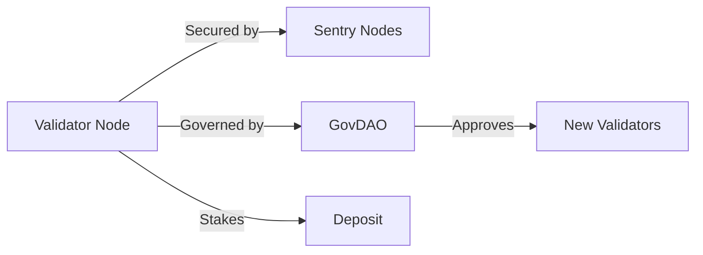

# 🛡️ Road to Validation
## Becoming a Testnet Validator on Gno.land

Secure the network and earn rewards through decentralized consensus

<!-- 
Focus on:
- Technical requirements
- Contribution expectations
- GovDAO approval process
-->

---
layout: top-title
color: blue
---

:: title ::
# 🧩 Validator Overview
:: content ::

**gno.land validators** maintain network security through Tendermint consensus 
- **Responsibilities**:
  - Execute transactions and produce blocks
  - Participate in governance voting
  - Maintain node infrastructure
- **Requirements**:
  - Technical expertise in node operations
  - Continuous contributions to ecosystem
  - Minimum 20M ugnot deposit (testnet) 

**Key Architecture**:


---
layout: top-title
color: purple
---

:: title ::
# 🚀 Step 1: Register Valoper Profile
:: content ::

### Profile Requirements 
- **Validator Name**: Unique identifier
- **Networks Validated**: Current networks + Assets Under Management
- **Digital Presence**: Website/social links
- **Contact Details**: Public contact channel
- **Contribution Plan**: Past/future ecosystem contributions

### Registration Command
```bash
gnokey maketx call \
  -pkgpath "gno.land/r/gnoland/valopers/v2" \
  -func "Register" \
  -gas-fee 1000000ugnot \
  -gas-wanted 30000000 \
  -send "20000000ugnot" \  # 20M ugnot anti-abuse deposit
  -args "<moniker>" \
  -args "<description>" \
  -args "<validator_address>" \
  -args "<public_key_validator>" \
  -remote "https://rpc.test6.testnets.gno.land:443" \
  <key-name>
```

**Note**: ChainID and remote may change - verify latest testnet info 

---
layout: top-title
color: green
---

:: title ::
# 📝 Step 2: Submit Validator Proposal
:: content ::

### GovDAO Sponsorship
Only GovDAO members can submit validator proposals:
1. Reach out on **Discord** for sponsorship
2. Provide your validator address
3. Prepare contribution evidence

### Self-Nomination (GovDAO Members)
```bash
gnokey maketx call \
  -pkgpath "gno.land/r/gnoland/valopers_proposal/v2" \
  -func "ProposeNewValidator" \
  -gas-fee 1000000ugnot \
  -gas-wanted 20000000 \
  -send "100000000ugnot" \  # 100M ugnot deposit
  -args "<validator_address>" \
  -remote "https://rpc.test6.testnets.gno.land:443" \
  <key-name>
```

**Critical**: Maintain active communication with GovDAO throughout process 

---
layout: top-title
color: orange
---

:: title ::
# 🗳️ Step 3: GovDAO Voting
:: content ::

### Approval Process
1. **Review Phase** (1-3 days):
   - Technical capability assessment
   - Contribution history verification
   - Infrastructure audit 

2. **Voting Phase** (48 hours):
   - Majority approval required
   - Weighted by stake/participation

3. **Onboarding**:
   - Added to validator set
   - Begin block production
   - Start earning rewards

**Pro Tip**: Monitor proposal status via:
```bash
gnokey query tx <TX_HASH> \
  --remote https://rpc.test6.testnets.gno.land:443
```

---
layout: top-title
color: teal
---

:: title ::
# ⚙️ Hardware Requirements
:: content ::

<v-grid columns="2" gap="4">

### 🖥️ Validator Nodes
- **CPU**: 4-8 cores
- **RAM**: 8-16 GB
- **Storage**: 512GB+ SSD (archive nodes) 
- **Network**: Gigabit connection
- **Security**: Behind sentry nodes

### 🌐 Sentry Nodes (Recommended)
- **CPU**: 8-16 cores
- **RAM**: 16-32 GB
- **Storage**: 512GB+ SSD
- **Bandwidth**: DDoS protection

### ☁️ Cloud Examples
- AWS: `m6a.large` (validator), `c6a.2xlarge` (sentry)
- GCP: `e2-standard-4` (validator), `n2-highmem-8` (sentry) 

</v-grid>

---
layout: top-title
color: violet
---

:: title ::
# 🔄 Maintaining Validator Status
:: content ::

### Ongoing Requirements
- **Uptime**: >95% block production
- **Upgrades**: Timely software updates
- **Security**: Regular audits and key rotation
- **Governance**: Active voting participation

### Contribution Expectations
- Code contributions to Gno repositories
- Documentation improvements
- Community support (Discord, forums)
- Tooling development (e.g., monitoring) 

**Penalties**:
- Slashing for downtime/misbehavior
- Removal from set for inactivity
- Deposit forfeiture for malicious acts

---
layout: center
---

# 💰 Testnet Economics


**Key Notes**:
- ⚠️ Testnet tokens have **no real value** 
- Use faucets for testnet funds: `portal.gno.land/faucet`
- Deposits are anti-spam measures, not purchases
- Mainnet economics will differ significantly

---
layout: center
---

# 🚀 Getting Started Checklist

1. [ ] Acquire testnet GNOT from faucet
2. [ ] Set up validator node infrastructure
3. [ ] Prepare valoper profile documentation
4. [ ] Execute `Register` transaction
5. [ ] Engage GovDAO for sponsorship
6. [ ] Monitor proposal voting status
7. [ ] Configure monitoring/alerting
8. [ ] Join DevOps community [gnops.io](https://gnops.io)

**Resources**:
- [Valoper Registry](https://gno.land/r/gnoland/valopers)
- [Discord Channel](https://discord.gg/gnoland)
- [Hardware Guide](https://gnops.io/articles/effective-gnops/validator-specs/) 
