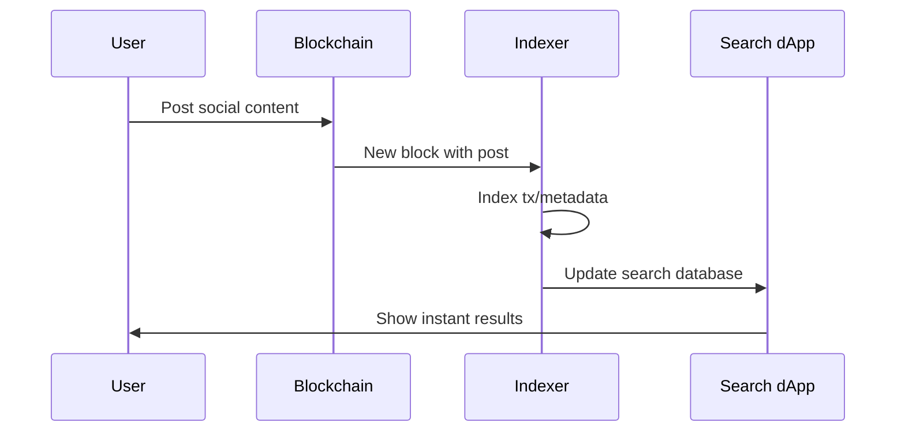
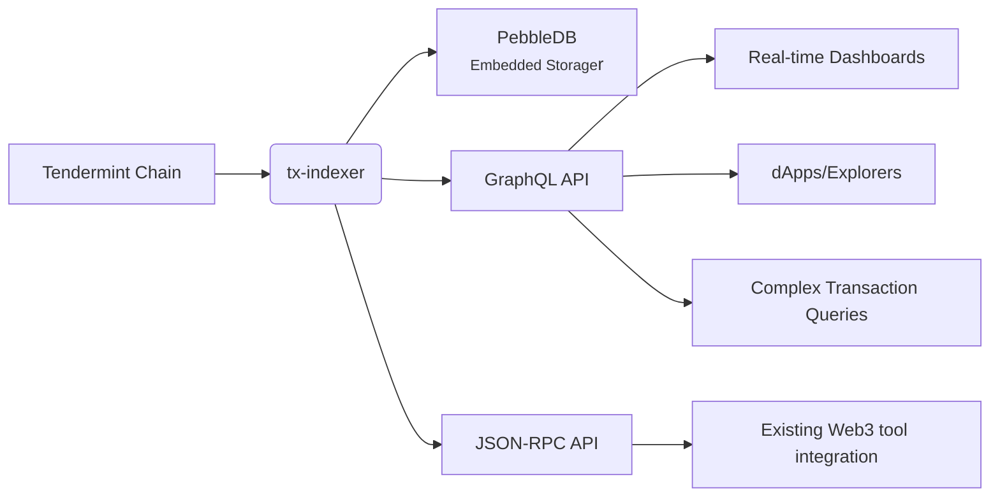
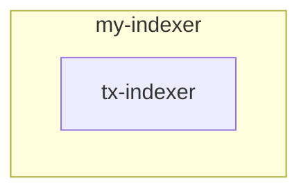

# 🚀 Gnolang Transaction Indexer  

How tx-indexer transforms raw blockchain data  
Into query-friendly structured information

---

# What is a Blockchain Indexer?

<div class="grid grid-cols-2 gap-8">
<div>

### Raw Blockchain Data
```json
{
  "height": 12345,
  "txs": [
    {
      "hash": "0x3F86...D9A1",
      "sender": "g1...abc",
      "receiver": "g1...xyz",
      "amount": "100ugnot"
    }
  ]
}
```
</div>
<div>

### Indexer Transforms Data
```json
{
  "address": "g1...xyz",
  "balance": "250ugnot",
  "tx_count": 5,
  "first_seen": "2025-10-01"
}
```
</div>
</div>

**Indexer = Database + Search Engine for Blockchain**  
Transforms raw chain data into query-friendly format

---

# ⭐ Use Case: Decentralized Social Search



---

# `tx-indexer` the official TM2 minimalist indexer 


- **High Performance**: Concurrent block processing pipeline

---

# Implement data visualizer through `tx-indexer`
### Foo20 - GRC20 basic token visualizer
 

- 1. Create your GraphQL subscription of foo20's transactions
- 2. Parse out useful metrics (amount transfered, block height, ...)
- 3. Pushes those metrics into your data-base (Like Prometheus)
- 4. Your application (Like Grafana) queries that database to display real-time charts


---

# Implement advanced indexer through `tx-indexer`
 
<div style="text-align: center">

</div>