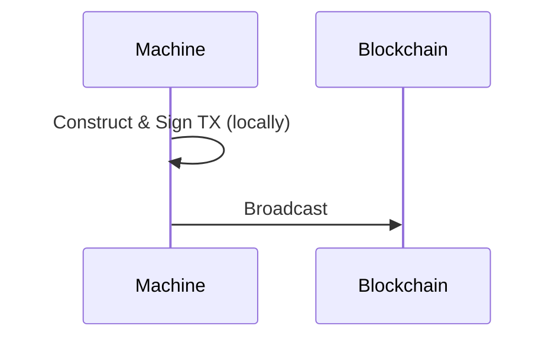
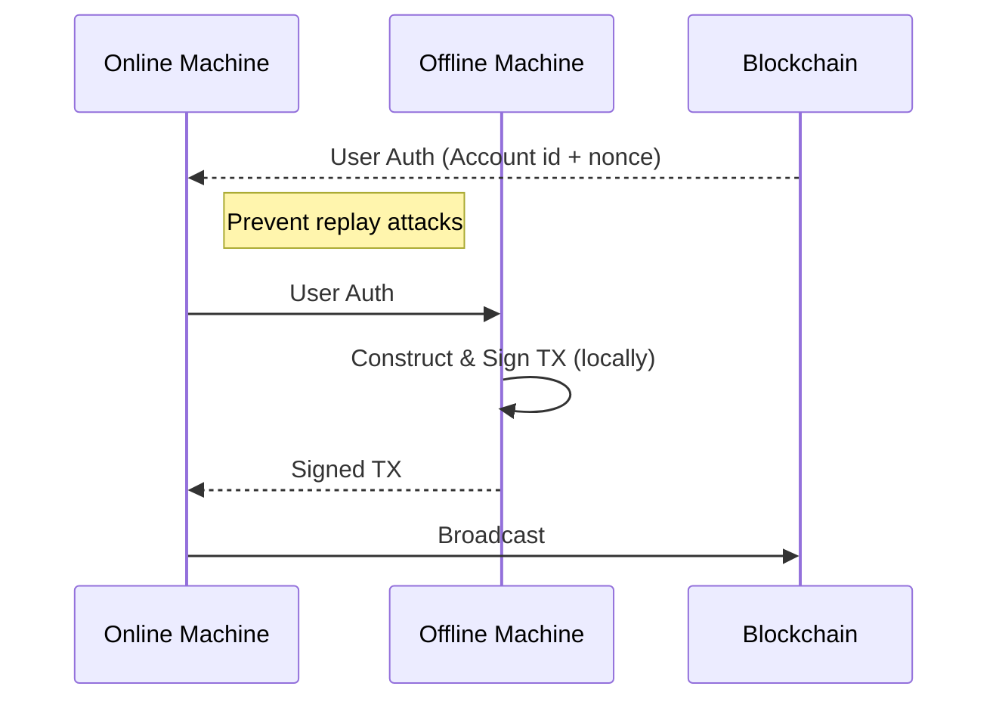
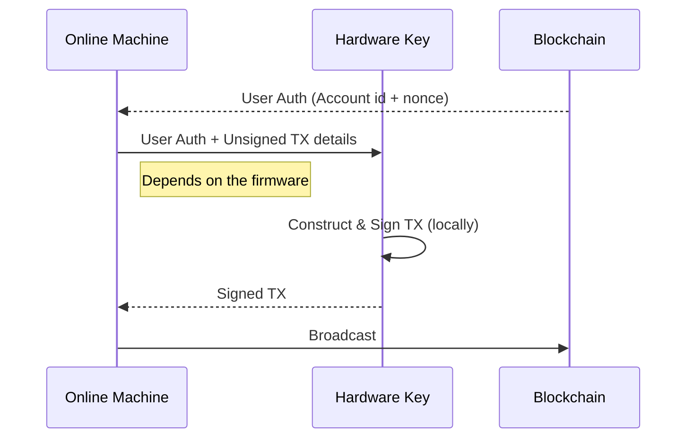
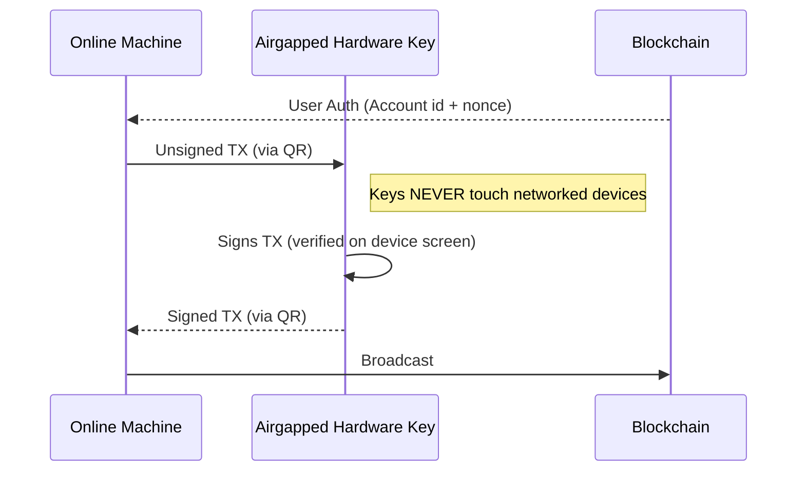
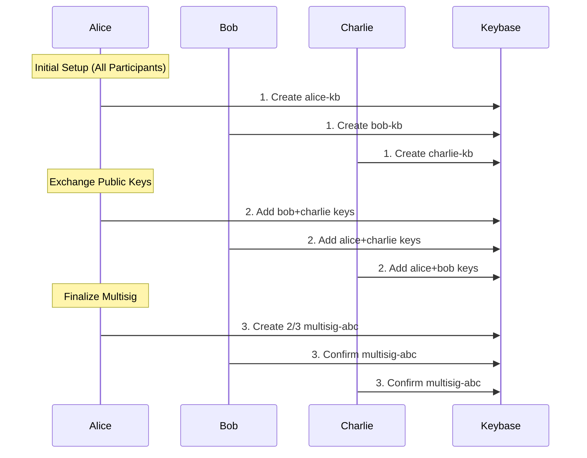
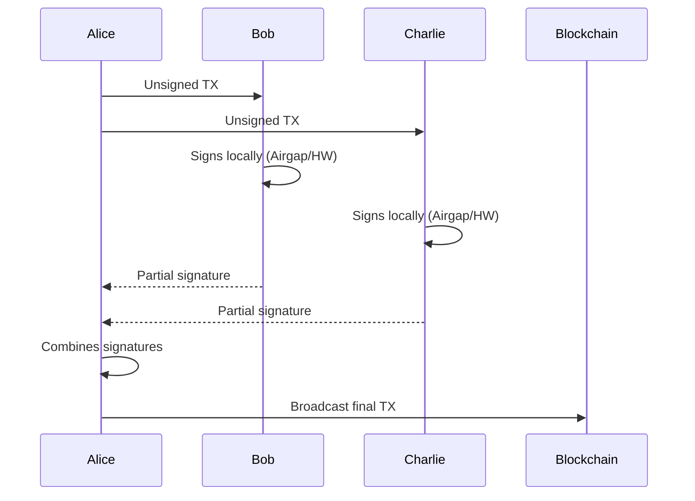
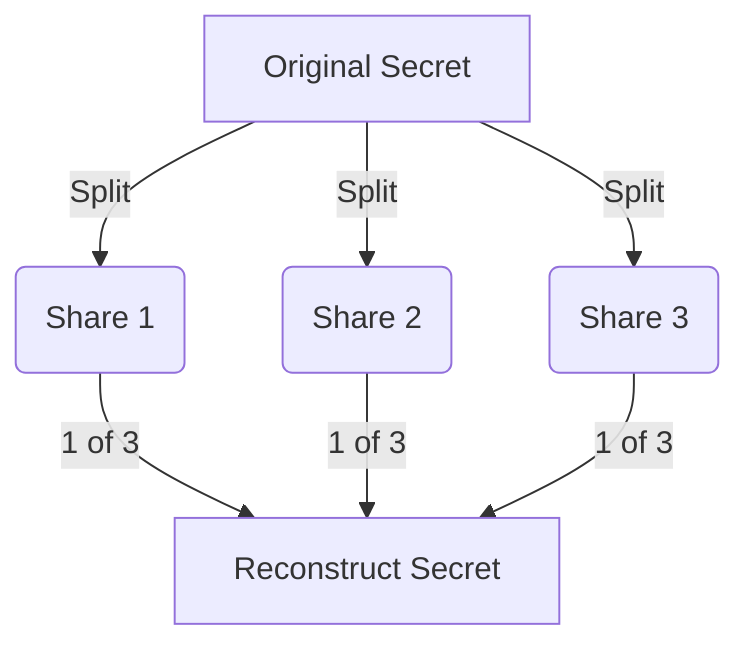

# 🛠️ Secure your wallet
## Airgap transaction and Hardware key

<!--
Gnokey is the primary CLI tool for interacting with Gno chains
It handles key management, transaction signing, and querying
Let's explore the secure way to interact with Gnoland by using Airgap tx and Hardware keys.
-->


---
layout: top-title
color: green
---

:: title ::
# 🔑 How to do a Transactions?
:: content ::

<div style="text-align: center">


</div>

---

# Why using safe transaction? 

- 🔑 Memory scraping attacks
- ⌨️ Keyloggers capturing passwords
- 🌐 MITM transaction hijacking
- 📧 Phishing fake transaction prompts
- etc...

**Risks when Signing in an Online environment** ⚠️

<!--

Gnokey is a non custodial wallet, it means it is only secured by cryptography.

By being so, you are vulnerable
Being careful is not everything, 


-->

---
layout: top-title
color: purple
---

:: title ::
# 🔒 Airgap Transactions
:: content ::

<div style="text-align: center">


</div>

<!--
What is an airgap transaction?

-->

---
layout: top-title
color: blue
---

:: title ::
# 🛡️ Hardware Key 
:: content ::

<div style="text-align: center">


</div>

<!--
What is an hardware key?


✅ **Hardware Key Advantages**:
- 🔐 Private keys never leave secure element
- 🔒 Physical confirmation required
- 🛡️ Tamper-resistant design
- 🧪 Immune to computer malware
- 🔋 Portable security
-->


---
layout: top-title
color: cyan
---

:: title ::
# 🛡️ Hardware Key + Airgap Security
:: content ::

<div style="text-align: center">


</div>

---
layout: top-title
color: cyan
---

:: title ::
# 🛡️ Hardware Key + Airgap Security
:: content ::


| **Advantages** ✅                          | **Limitations** ⚠️                     | 
|-----------------------------------------|-------------------------------------|
| **Isolation** (No USB/Bluetooth) |  **Slower** (Manual transfers)    |
| **Physical verification** (On-device display) | **Complex setup** (QR workflow) |
| **Immune to malware** (No driver exploits) | **Dependent on device security** (Firmware risks remain) |

⚠️ **Airgap ≠ Perfect Security**
- Always verify TX details **on the hardware key’s screen**.  

---
layout: top-title-two-cols
color: orange
---

:: title ::
# Hardware Key vs Airgap Environment

:: left ::
## 🛡️ Hardware Key
**Pros:**
<div class="ns-c-tight">

- **Instant signing process**
- **Tamper-proof hardware**
- Private keys never exposed
- Portable (works with any computer)
- Physical confirmation required
</div>

**Cons:**
<div class="ns-c-tight">

- **Hardware cost** 💰
- **Limited to supported blockchains**
- Firmware updates needed
</div>

:: right ::
## 🔒 Airgap Environment
**Pros:**
<div class="ns-c-tight">

- **Works with any offline device**
- **No special hardware needed**
- Flexible for any blockchain
- Complete network isolation
- Can store multiple key types
</div>

**Cons:**
<div class="ns-c-tight">

- **Multi-step process**
- Requires data transfer method
- Dependent on offline device security
- Manual setup complexity
</div>

---
layout: top-title
color: green
---

:: title ::
# What you should go for (keys)
:: content :: 
<div class="ns-c-tight">

#### Hardware Key - Most Secure + Convenient 
##### Recommended way ✅
- Ledger, Trezor, ...

#### AirGap Vault - Secure but inconvenient 🔒
##### Must be offline ⚠️
- **Hardware based** - Old smartphone, Old Laptop, dedicated Raspberry Pi
- **USB** - Tails OS (Amnesic system)
- **Mobile (IOS/Android)** - **Adena Mobile** (Gno compatible), Metamask, AirGap 
    - **Bonus**: Use dedicated profile with secured alternative OS (GrapheneOS)
- **Qubes OS** - QEMU/KVM

#### Encrypted Keys - Good first step 
- **Local password manager** - KeepassXC

#### Native Way - Convenient but vulnerable 👾
- Gnokey
</div>

<!--
QR code signing, offline OS mode 

I'm not affiliated to any of this company, they are just example.
https://www.ledger.com/
https://trezor.io/
https://www.yubico.com/

Tails OS on USB (amnesic system)
Old smartphone (permanently offline)
Dedicated Raspberry Pi (~$35)
-->


---
layout: top-title
color: green-light
---

:: title ::
# 🛡️ Security Best Practices (mnemonics)
:: content ::

<div class="ns-c-tight">

#### 🔑 Key Management
- **Never store mnemonics in clear on networked machines** ⚠️
- Encrypt it using password manager -- Preferably locally (KeepassXC)
- Use dedicated offline device for keys (hardware key, USB key, Old smartphone)

#### 🌐 Transaction Safety
- **Always verify TX details before signing**
- **Double-check recipient addresses**
- Use testnet for experiments 

#### 🛟 Recovery
- Test recovery process periodically ⏲️
- Store mnemonics/second hardware key in fireproof safe (At home, bank)

</div>

---
layout: top-title
color: purple
---

:: title ::
# ✍️ Multi-Signature Setup
:: content ::

<div style="text-align: center">



</div>

<!--
### 1. Create Multisig Account
### 2. Fund the Account
### 3. Verify Setup
-->


---
layout: top-title
color: purple
---

:: title ::
# ✍️ Multi-Signature Execution
:: content ::

<div style="text-align: center">


</div>


---
layout: top-title
color: purple
---

:: title ::
# 🔐 Shamir Secret Sharing (SSS)

:: content ::

<div style="text-align: center">



</div>

<!--
### Core Concept
- **Split** secrets into `N` shares
- **Reconstruct** with any `M` shares (`M ≤ N`)
- **Single shares** reveal *zero* information about original secret
-->

---


## 🛡️ Security Advantages

| Feature                | Benefit                                                                 |
|------------------------|-------------------------------------------------------------------------|
| **Threshold Security** | Compromise of < M shares reveals nothing                                |
| **Dynamic Allocation** | Add/revoke shares without changing secret                              |
| **Progressive Trust**  | Distribute shares across entities/locations                             |
| **Verifiable Shares**  | Cryptographic proofs of share validity                                  |

---

## 🧩 Practical Implementation

### Creating Shares (3-of-5)
```bash
# Using ssss utility
echo "MyCryptoSecret" | ssss-split -t 3 -n 5
Generating shares using a (3,5) scheme...
Share 1: 1-8feb3d4c9a
Share 2: 2-71c9205bf3
Share 3: 3-02a9d67e81
Share 4: 4-d5b1c8f23e
Share 5: 5-6e9a0b47cd
```

### Recovering Secret
```bash
ssss-combine -t 3
Enter 3 shares:
Share 1: 3-02a9d67e81
Share 2: 5-6e9a0b47cd
Share 3: 1-8feb3d4c9a
Result: MyCryptoSecret
```

<!--

Code part - What to demonstrate:
- How to do a simple transaction 
- How to do an airgap transaction (in local)
- Hardware key https://github.com/gnolang/gno/issues/1119
- Using Adena Wallet https://www.adena.app/
- Multi-sign using the script
-->

---
layout: top-title
color: amber
---

:: title ::
# 🚀 Next Steps
:: content ::

### Practical Exercises:
1. Setup airgap environment
2. Create 2/3 multisig wallet
3. Perform secure contract deployment

### Advanced Topics:
- Hardware wallet integration (Ledger)
- Transaction monitoring tools -- Using `tx-indexer`
- Secure key rotation procedures (Useful for multisign)

<div class="mt-8 text-center">
<a href="https://github.com/gnolang/gno" target="_blank" class="!no-underline">
  <button class="bg-amber-500 hover:bg-amber-600 text-white py-3 px-6 rounded-lg">
    Explore Gno Documentation
  </button>
</a>
</div>